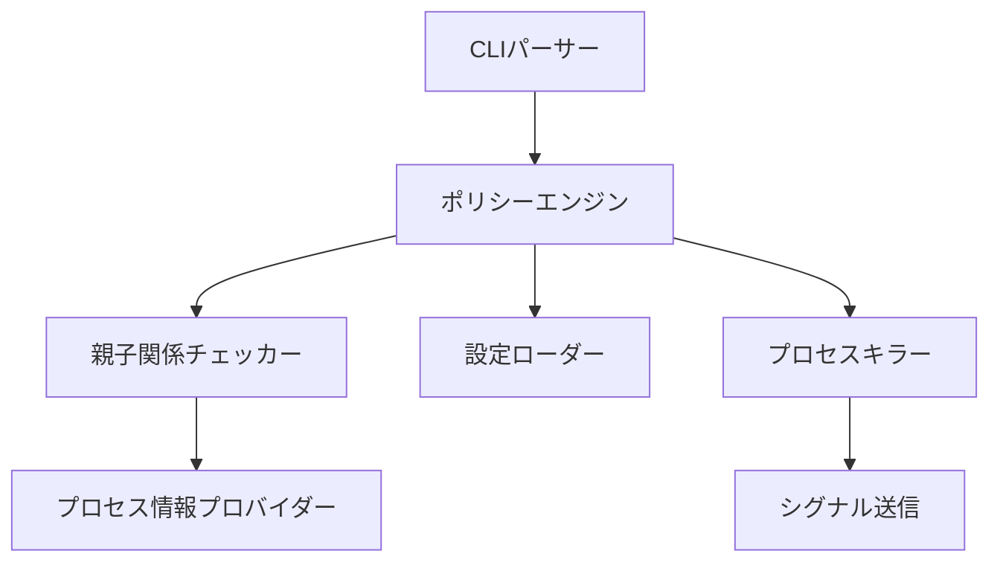
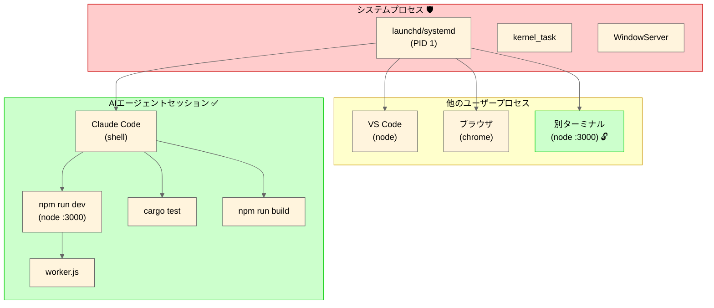

<h1 align="center">safe-kill</h1>

<p align="center">
  <strong>AIエージェント向けの安全なプロセス終了ツール（親子関係に基づくアクセス制御）</strong>
</p>

<p align="center">
  <a href="https://github.com/owayo/safe-kill/actions/workflows/ci.yml">
    
  </a>
  <a href="https://github.com/owayo/safe-kill/releases/latest">
    
  </a>
  <a href="LICENSE">
    
  </a>
</p>

<p align="center">
  <a href="README.md">English</a> |
  <a href="README.ja.md">日本語</a>
</p>

---

## 概要

`safe-kill` は、AIエージェントがシステムプロセスや無関係なアプリケーションを誤って終了させることを防ぐCLIツールです。**親子関係に基づくアクセス制御**を強制し、エージェントのセッションから派生したプロセスのみを終了できます。

## 特徴

- **親子関係検証**: セッションから派生したプロセスのみ終了可能
- **自己破壊防止**: 自身や親プロセスの終了を防止
- **設定可能なリスト**: 許可リスト・拒否リストによる細かな制御
- **複数シグナル対応**: SIGTERM、SIGKILL、SIGHUPなど
- **ドライランモード**: 実際に終了せずにプレビュー
- **プロセス検出**: セッション内の終了可能なプロセス一覧表示

## 動作環境

- **OS**: macOS、Linux
- **Rust**: 1.70以上（ソースからビルドする場合）

## インストール

### ソースからビルド

```bash
cargo install --path .
```

### バイナリダウンロード

[Releases](https://github.com/owayo/safe-kill/releases) から最新版をダウンロード。

## クイックスタート

```bash
# 終了可能なプロセス一覧
safe-kill --list

# PIDを指定して終了（安全チェック付き）
safe-kill 12345

# プロセス名で終了
safe-kill --name node

# ドライラン（実行せずにプレビュー）
safe-kill --name python --dry-run
```

## 使い方

### コマンド

```bash
safe-kill [OPTIONS] [PID]
```

### オプション

| オプション | 短縮形 | 説明 |
|-----------|-------|------|
| `--name <NAME>` | `-N` | プロセス名で終了（pkill形式） |
| `--port <PORT>` | `-p` | 指定したポートを使用するプロセスを終了 |
| `--signal <SIGNAL>` | `-s` | 送信するシグナル（デフォルト: SIGTERM） |
| `--list` | `-l` | 終了可能なプロセス一覧 |
| `--dry-run` | `-n` | シグナルを送信せずにプレビュー |
| `--help` | `-h` | ヘルプ表示 |
| `--version` | `-V` | バージョン表示 |

### シグナル

シグナルは名前または番号で指定できます:

| シグナル | 番号 | 説明 |
|---------|-----|------|
| SIGTERM | 15 | 正常終了（デフォルト） |
| SIGKILL | 9 | 強制終了 |
| SIGHUP | 1 | ハングアップ |
| SIGINT | 2 | 割り込み |
| SIGQUIT | 3 | 終了 |
| SIGUSR1 | 10 | ユーザー定義シグナル1 |
| SIGUSR2 | 12 | ユーザー定義シグナル2 |

### 使用例

```bash
# 正常終了
safe-kill 12345

# 強制終了
safe-kill --signal SIGKILL 12345
safe-kill -s 9 12345

# セッション内のすべてのnodeプロセスを終了
safe-kill --name node

# ポート3000を使用するプロセスを終了
safe-kill --port 3000

# 終了対象をプレビュー
safe-kill --name python --dry-run
```

## 設定

`safe-kill init` で設定を初期化するか、`~/.config/safe-kill/config.toml` を手動で作成:

```toml
# 親子関係チェックをバイパスするプロセス（慎重に使用）
[allowlist]
processes = ["my-trusted-app"]

# 絶対に終了できないプロセス（許可リストより優先）
[denylist]
processes = ["launchd", "systemd", "init", "kernel_task"]

# --port オプションで許可するポート
# 指定しない場合、--port オプションは無効（ポート指定でのkillは不可）
[allowed_ports]
ports = ["1420", "3000-3010", "8080"]
#   - 1420: Tauri開発サーバー
#   - 3000-3010: Node.js開発サーバー
#   - 8080: HTTP代替ポート
```

### デフォルト拒否リスト

以下のシステムプロセスはデフォルトで保護されます:

**macOS**: `launchd`, `kernel_task`, `WindowServer`, `loginwindow`, `Finder`, `Dock`, `SystemUIServer`

**Linux**: `systemd`, `init`, `kthreadd`, `rcu_sched`, `migration`

## アーキテクチャ



### 安全レイヤー

1. **自己破壊防止**: 自身および親プロセスの終了を拒否
2. **拒否リストチェック**: システムプロセスは常に保護
3. **親子関係検証**: ルートセッションの子孫のみ終了可能
4. **許可リストバイパス**: 信頼されたプロセスは親子関係チェックをスキップ

### プロセスツリーと終了可能範囲



| プロセス | `--name`で終了 | `--port`で終了 | 理由 |
|---------|---------------------|----------------------|--------|
| `npm run dev` (:3000) | ✅ 可能 | ✅ 可能 | セッションの子孫 |
| `worker.js` | ✅ 可能 | - | セッションプロセスの子 |
| `cargo test` | ✅ 可能 | - | セッションの子孫 |
| 別ターミナル (:3000) | ❌ 不可 | ✅ 可能 | allowed_portsに含まれる（親子関係をバイパス） |
| VS Code (`node`) | ❌ 不可 | ❌ 不可 | 子孫ではない、許可ポートなし |
| ブラウザ | ❌ 不可 | ❌ 不可 | 子孫ではない |
| `launchd`/`systemd` | ❌ 不可 | ❌ 不可 | システムプロセス（拒否リスト） |

**ポイント**:
- `safe-kill --name node`: セッション内（緑のエリア）の `node` プロセスのみが終了。親子関係チェック必須。
- `safe-kill --port 3000`: ポート3000が `allowed_ports` に設定されていれば、**親子関係に関係なく**終了可能。別ターミナルで起動したままの開発サーバー等を終了する場合に便利。
- `--port` オプションは `config.toml` での明示的な設定が必要です。設定がない場合、ポート指定でのkillは無効です。

## 終了コード

| コード | 意味 |
|-------|------|
| 0 | 成功 |
| 1 | 対象が見つからない |
| 2 | 権限エラー |
| 3 | 設定エラー |
| 255 | 一般エラー（無効なシグナル、自己破壊試行など） |

## 環境変数

| 変数 | 説明 |
|-----|------|
| `SAFE_KILL_ROOT_PID` | 親子関係チェックのルートPIDを上書き |

## Claude Code 統合

Claude Code で `kill`/`pkill` コマンドの代わりに `safe-kill` を使用するための設定。

### 1. フック設定

`.claude/settings.json` に追加:

```json
{
  "hooks": {
    "PreToolUse": [
      {
        "matcher": "Bash",
        "hooks": [
          {
            "type": "command",
            "command": "if echo \"$TOOL_INPUT\" | grep -qE '(^|[;&|])\\s*(kill|pkill|killall)\\s'; then echo '🚫 safe-kill を使用: safe-kill <PID> または safe-kill -n <名前> (pkill相当)。シグナル指定は -s <signal>' >&2; exit 2; fi"
          }
        ]
      }
    ]
  }
}
```

`kill`/`pkill`/`killall` コマンドが検出されると、フックがメッセージを stderr に出力し、終了コード 2 でツール呼び出しをブロックします。メッセージは Claude に表示されます。

### 2. CLAUDE.md への記載

`CLAUDE.md` に追加:

```markdown
## プロセス管理ルール

- `kill`、`pkill`、`killall` を直接使用しないでください。安全のため制限されています。
- プロセスを終了するには `safe-kill <PID>`、`safe-kill --name <プロセス名>`、または `safe-kill --port <ポート>` を使用してください。
- `safe-kill` はターゲットプロセスがセッションの子孫であることを自動的に検証します。
- `safe-kill` が失敗した場合、そのプロセスはあなたの管理下にない可能性があります。

### 使用例
- テストサーバーを終了: `safe-kill --name node`
- ポート3000を使用するプロセスを終了: `safe-kill --port 3000`
- スタックしたプロセスを強制終了: `safe-kill -s 9 <PID>`
- 終了対象をプレビュー: `safe-kill --name python --dry-run`
```

## 開発

```bash
# ビルド
cargo build

# テスト実行
cargo test

# リリースビルド
cargo build --release
```

### テストカバレッジ

- **ユニットテスト**: 全モジュールを網羅する161テスト
- **統合テスト**: 実際のプロセスツリーを使用した27テスト
- **E2Eテスト**: CLI動作を検証する30テスト

## コントリビュート

プルリクエストを歓迎します！お気軽にご貢献ください。

## セキュリティ

セキュリティ脆弱性を発見した場合は、[GitHub Issues](https://github.com/owayo/safe-kill/issues) で報告してください。

## ライセンス

[MIT](LICENSE)
