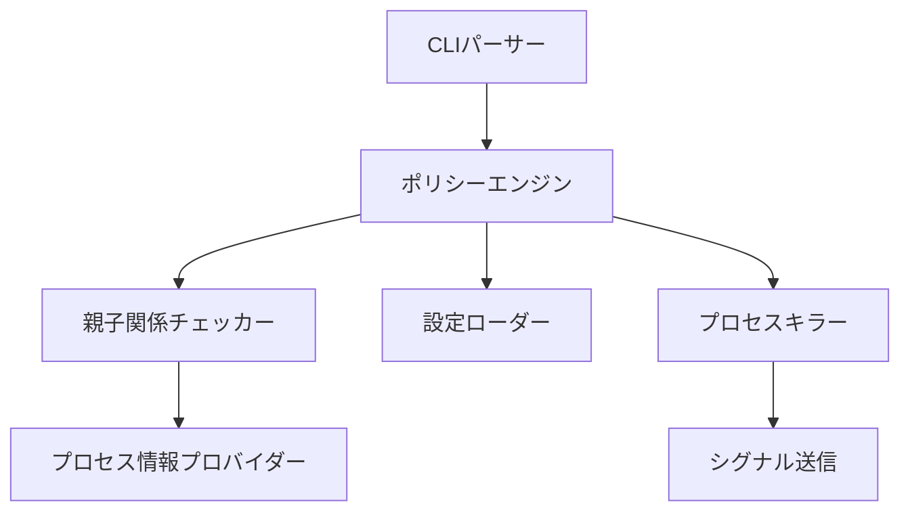
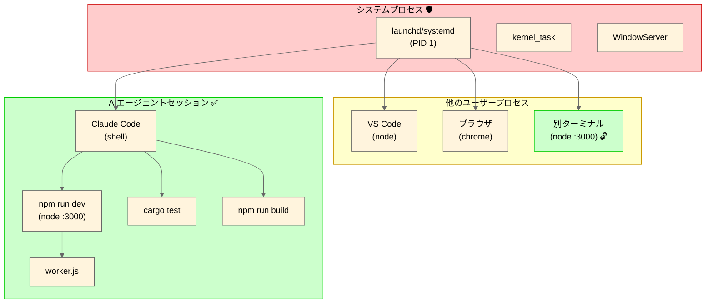

<h1 align="center">safe-kill</h1>

<p align="center">
  <strong>AIエージェント向けの安全なプロセス終了ツール（親子関係に基づくアクセス制御）</strong>
</p>

<p align="center">
  <a href="https://github.com/owayo/safe-kill/actions/workflows/ci.yml">
    
  </a>
  <a href="https://github.com/owayo/safe-kill/releases/latest">
    
  </a>
  <a href="LICENSE">
    
  </a>
</p>

<p align="center">
  <a href="README.md">English</a> |
  <a href="README.ja.md">日本語</a>
</p>

---

## 概要

`safe-kill` は、AIエージェントがシステムプロセスや無関係なアプリケーションを誤って終了させることを防ぐCLIツールです。**親子関係に基づくアクセス制御**を強制し、エージェントのセッションから派生したプロセスのみを終了できます。

## 特徴

- **親子関係検証**: セッションから派生したプロセスのみ終了可能
- **自己破壊防止**: 自身や親プロセスの終了を防止
- **PID検証**: 危険なPID値（`0` と `i32::MAX` 超過）を拒否
- **PID再利用検出**: シグナル送信直前に対象の同一性 (`pid + start_time + name`) を再検証し、ポリシー判定と `kill(2)` の間に発生する PID 再利用 (TOCTOU) を緩和
- **ポート保持の再検証**: `--port` 指定 kill では、シグナル送信直前に対象ポートを保持しているプロセス集合を再取得し、対象 PID/プロトコルが含まれない場合は `NoProcessOnPort` として fail-closed
- **設定可能なリスト**: 許可リスト・拒否リストによる細かな制御
- **複数シグナル対応**: SIGTERM、SIGKILL、SIGHUPなど
- **ドライランモード**: 実際に終了せずにプレビュー
- **プロセス検出**: セッション内の終了可能なプロセス一覧表示
- **ポート指定クリーンアップ**: 設定済みの TCP リスナーまたは UDP ソケットをローカルポートで終了
- **決定的な処理順**: バッチ一致結果と終了可能プロセス一覧を PID 昇順にそろえ、出力を再現しやすくする
- **正確な失敗報告**: ポリシーチェック通過後の `ProcessNotFound` / `PermissionDenied` をそのまま返す

## 動作環境

- **OS**: macOS、Linux
- **Rust**: 1.85以上（ソースからビルドする場合）

## インストール

### ソースからビルド

```bash
cargo install --path .
```

### バイナリダウンロード

[Releases](https://github.com/owayo/safe-kill/releases) から最新版をダウンロード。

## クイックスタート

```bash
# 終了可能なプロセス一覧
safe-kill --list

# PIDを指定して終了（安全チェック付き）
safe-kill 12345

# プロセス名で終了
safe-kill --name node

# ドライラン（実行せずにプレビュー）
safe-kill --name python --dry-run
```

## 使い方

### コマンド

```bash
safe-kill [OPTIONS] [PID]
safe-kill init [--force]
```

`init` は単独で使うサブコマンドです。`PID`、`--name`、`--port`、`--list`、`--signal`、`--dry-run` とは組み合わせできません。

### オプション

| オプション | 短縮形 | 説明 |
|-----------|-------|------|
| `--name <NAME>` | `-N` | プロセス名の完全一致で終了 |
| `--port <PORT>` | `-p` | 指定ポートを使う設定済み TCP リスナーまたは UDP ソケットを終了（`1`-`65535`。`0` は拒否） |
| `--signal <SIGNAL>` | `-s` | 送信するシグナル（デフォルト: SIGTERM） |
| `--list` | `-l` | 終了可能なプロセス一覧 |
| `--dry-run` | `-n` | シグナルを送信せずにプレビュー |
| `--help` | `-h` | ヘルプ表示 |
| `--version` | `-V` | バージョン表示 |

### シグナル

シグナルは名前または番号で指定できます:

| シグナル | 番号 | 説明 |
|---------|-----|------|
| SIGTERM | 15 | 正常終了（デフォルト） |
| SIGKILL | 9 | 強制終了 |
| SIGHUP | 1 | ハングアップ |
| SIGINT | 2 | 割り込み |
| SIGQUIT | 3 | 終了 |
| SIGUSR1 | 10 (Linux) / 30 (macOS) | ユーザー定義シグナル1（プラットフォーム固有の番号のみ） |
| SIGUSR2 | 12 (Linux) / 31 (macOS) | ユーザー定義シグナル2（プラットフォーム固有の番号のみ） |

### 使用例

```bash
# 正常終了
safe-kill 12345

# 強制終了
safe-kill --signal SIGKILL 12345
safe-kill -s 9 12345

# セッション内のすべてのnodeプロセスを終了
safe-kill --name node

# ポート3000を使う設定済み TCP リスナーまたは UDP ソケットを終了
safe-kill --port 3000

# 終了対象をプレビュー
safe-kill --name python --dry-run
```

`--name` / `--port` の dry-run では、実際に kill したと誤解しないように集計行を `would kill` 表示にしています。

`--name` は実行ファイル名の完全一致で判定します。部分一致やパターン一致は行いません。

`--name` で複数プロセスが一致した場合、結果は PID 昇順で処理・表示されるため、繰り返し実行しても順序が安定します。

`--port` は TCP では `LISTEN` 状態のソケットだけを対象にします。同じローカルポートを持つ接続済み TCP クライアントソケットは対象外です。UDP は接続状態を持たないため、ローカルポート一致で対象にします。ポート `0` は OS の自動割り当て用の特殊値であり、終了対象ではないため常に拒否します。

### エラーハンドリング

ポリシーチェックは通過したがシグナル送信前に対象プロセスが終了していた場合や、OS により送信が拒否された場合は、`NoKillableTarget` に丸めず `ProcessNotFound` や `PermissionDenied` として元の実行時エラーを返します。

## 設定

`safe-kill init` で設定を初期化するか、`~/.config/safe-kill/config.toml` を手動で作成:

```toml
# 親子関係チェックをバイパスするプロセス（慎重に使用）
[allowlist]
processes = ["my-trusted-app", "next-server"]

# 追加で絶対に終了できないプロセス（許可リストより優先）
# システム保護の既定 denylist は維持され、この設定はそこへ追加されます
[denylist]
processes = ["postgres"]

# --port オプションで許可するポート
# 指定しない場合、--port オプションは無効（ポート指定でのkillは不可）
# 有効な値は 1-65535。ポート 0 は設定に含めても常に拒否されます。
[allowed_ports]
ports = ["1420", "3000-3010", "5173", "8080"]
#   - 1420: Tauri開発サーバー
#   - 3000-3010: Node.js開発サーバー
#   - 5173: Vite開発サーバー
#   - 8080: HTTP代替ポート
```

### デフォルト拒否リスト

以下のシステムプロセスはデフォルトで保護されます:

**macOS**: `launchd`, `kernel_task`, `WindowServer`, `loginwindow`, `Finder`, `Dock`, `SystemUIServer`

**Linux**: `systemd`, `init`, `kthreadd`, `dbus-daemon`, `gnome-shell`, `Xorg`, `sshd`

ユーザー定義の `[denylist]` はこの既定保護に追加されます。カスタマイズしてもシステムプロセスの保護は解除されません。

`config.toml` が存在するのにアクセス・読み込み・解析できない場合、または未知フィールドを含む場合、kill/list 系コマンドは設定エラーとして停止します。壊れた設定ファイルによってカスタム拒否リストが無視されることを防ぐため、デフォルト設定への暗黙フォールバックは行いません。

## アーキテクチャ


```mermaid
flowchart TB
    CLI[CLIパーサー] --> Policy[ポリシーエンジン]
    Policy --> Ancestry[親子関係チェッカー]
    Policy --> Config[設定ローダー]
    Policy --> Killer[プロセスキラー]
    Ancestry --> ProcInfo[プロセス情報プロバイダー]
    Killer --> Signal[シグナル送信]
```

### 安全レイヤー

1. **自己破壊防止**: 自身および親プロセスの終了を拒否
2. **PID検証**: 危険なPID値（`0`・範囲外）をシグナル送信前に拒否
3. **拒否リストチェック**: システムプロセスは常に保護
4. **ルートPID保護**: 信頼ルート自体は許可リストに含まれていても終了不可
5. **許可リストバイパス**: 信頼されたプロセスは親子関係チェックをスキップ
6. **親子関係検証**: ルートセッションの子孫のみ終了可能
7. **PID再利用検出 (TOCTOU 緩和)**: ポリシー判定後、`kill(2)` 直前に最新のプロセス情報を OS から取得し、`pid + start_time + name` の同一性を再検証。判定時と異なるプロセスへ PID が再利用されていれば `ProcessNotFound` で fail-closed する。`start_time` は秒精度のため、同一秒内に同名プロセスへ再利用されたケースは検出できない（実用上は極めて稀）。完全な保護には Linux の `pidfd_open` + `pidfd_send_signal` が必要
8. **ポート保持の再検証 (`--port` 指定時)**: `kill(2)` 直前に対象ポートの保持者集合を再取得し、判定時の対象 PID/プロトコルが含まれなければ `NoProcessOnPort` で fail-closed する。判定～kill の間に対象がポートを離した場合、ユーザーの「ポートを解放したい」意図は既に達成されているため、余計なシグナル送信を抑止する

### プロセスツリーと終了可能範囲


```mermaid
%%{init: {'theme': 'base', 'themeVariables': { 'lineColor': '#666666', 'primaryTextColor': '#000000', 'primaryBorderColor': '#666666' }}}%%
flowchart TB
    subgraph system["システムプロセス 🛡️"]
        init["launchd/systemd<br/>(PID 1)"]
        kernel["kernel_task"]
        window["WindowServer"]
    end

    subgraph other["他のユーザープロセス"]
        vscode["VS Code<br/>(node)"]
        browser["ブラウザ<br/>(chrome)"]
        otherdev["別ターミナル<br/>(node :3000) 🔓"]
    end

    subgraph session["AIエージェントセッション ✅"]
        shell["Claude Code<br/>(shell)"]
        shell --> server["npm run dev<br/>(node :3000)"]
        shell --> test["cargo test"]
        shell --> build["npm run build"]
        server --> worker["worker.js"]
    end

    init --> shell
    init --> vscode
    init --> browser
    init --> otherdev

    style system fill:#ffcccc,stroke:#cc0000,color:#000000
    style other fill:#ffffcc,stroke:#cc9900,color:#000000
    style session fill:#ccffcc,stroke:#00cc00,color:#000000
    style otherdev fill:#ccffcc,stroke:#00cc00,color:#000000
```

| プロセス | `--name`で終了 | `--port`で終了 | 理由 |
|---------|---------------------|----------------------|--------|
| `npm run dev` (:3000) | ✅ 可能 | ✅ 可能 | セッションの子孫 |
| `worker.js` | ✅ 可能 | - | セッションプロセスの子 |
| `cargo test` | ✅ 可能 | - | セッションの子孫 |
| 別ターミナル (:3000) | ❌ 不可 | ✅ 可能 | allowed_portsに含まれる（親子関係をバイパス） |
| VS Code (`node`) | ❌ 不可 | ❌ 不可 | 子孫ではない、許可ポートなし |
| ブラウザ | ❌ 不可 | ❌ 不可 | 子孫ではない |
| ルートセッションプロセス | ❌ 不可 | ❌ 不可 | 信頼ルート自体は子孫ではない |
| `launchd`/`systemd` | ❌ 不可 | ❌ 不可 | システムプロセス（拒否リスト） |

**ポイント**:
- `safe-kill --name node`: セッション内（緑のエリア）の `node` プロセスのみが終了。親子関係チェック必須。
- `safe-kill --port 3000`: ポート3000が `allowed_ports` に設定されていれば、自己破壊防止・拒否リスト・root PID 保護・ポート検証を維持したまま、**親子関係に関係なく** TCP リスナーまたは UDP ソケットを終了可能。別ターミナルで起動したままの開発サーバー等を終了する場合に便利。
- TCP のポート一致では `ESTABLISHED` などの非待ち受けソケットを無視するため、ローカルポートが一致しただけのクライアント接続は選択されません。
- `--port` オプションは `config.toml` での明示的な設定が必要です。設定がない場合、ポート指定でのkillは無効です。ポート `0` は範囲設定に含まれていても無効で、全有効ポートを許可する場合は `1-65535` を使います。
- `SAFE_KILL_ROOT_PID` は親子関係チェックの信頼ルートを変更しますが、その root PID 自体は保護されます。
- ポートを掴んでいる PID のプロセス情報が解決できない場合（検出後すぐに終了したケース等）、`safe-kill` は `pid:<pid>` のようなプレースホルダ名にフォールバックする代わりに `ProcessNotFound` で fail-closed します。これにより、実プロセス名が不明な状態で denylist 保護がバイパスされる事態を防ぎます。
- シグナル送信直前に対象ポートの保持者集合を再取得し、対象 PID が既にそのポートを離している場合は `NoProcessOnPort` として中止します。同一 PID が無関係な処理に切り替わっている場合に余計なシグナルを送らないための追加防御です。

## 終了コード

| コード | 意味 |
|-------|------|
| 0 | 成功 |
| 1 | 対象が見つからない（名前未一致、許可ポートにプロセスなし、または全件が終了不可） |
| 2 | 権限エラー |
| 3 | 設定エラー |
| 4 | ポート不許可 |
| 255 | 一般エラー（無効なシグナル・ポート、自己破壊試行など） |

## 環境変数

| 変数 | 説明 |
|-----|------|
| `SAFE_KILL_ROOT_PID` | 親子関係チェックのルートPIDを上書き（`0` や無効値は無視。root PID 自体は終了不可） |

## Claude Code 統合

Claude Code で `kill`/`pkill` コマンドの代わりに `safe-kill` を使用するための設定。

### 1. フック設定

`.claude/settings.json` に追加:

```json
{
  "hooks": {
    "PreToolUse": [
      {
        "matcher": "Bash",
        "hooks": [
          {
            "type": "command",
            "command": "if echo \"$TOOL_INPUT\" | grep -qE '(^|[;&|])\\s*(kill|pkill|killall)\\s'; then echo '🚫 safe-kill を使用: safe-kill <PID> または safe-kill --name <完全一致名>。シグナル指定は -s <signal>' >&2; exit 2; fi"
          }
        ]
      }
    ]
  }
}
```

`kill`/`pkill`/`killall` コマンドが検出されると、フックがメッセージを stderr に出力し、終了コード 2 でツール呼び出しをブロックします。メッセージは Claude に表示されます。

### 2. CLAUDE.md への記載

`CLAUDE.md` に追加:

```markdown
## プロセス管理ルール

- `kill`、`pkill`、`killall` を直接使用しないでください。安全のため制限されています。
- プロセスを終了するには `safe-kill <PID>`、`safe-kill --name <プロセス名>`、または `safe-kill --port <ポート>` を使用してください。
- `safe-kill` はターゲットプロセスがセッションの子孫であることを自動的に検証します。
- `safe-kill` が失敗した場合、そのプロセスはあなたの管理下にない可能性があります。

### 使用例
- テストサーバーを終了: `safe-kill --name node`
- ポート3000を使用するプロセスを終了: `safe-kill --port 3000`
- スタックしたプロセスを強制終了: `safe-kill -s 9 <PID>`
- 終了対象をプレビュー: `safe-kill --name python --dry-run`
```

## 開発

```bash
# ビルド
cargo build

# テスト実行
cargo test

# リリースビルド
cargo build --release
```

### テストカバレッジ

- **ライブラリユニットテスト**: 全モジュールを網羅する350テスト
- **バイナリユニットテスト**: CLI出力ユーティリティとバージョン検証の26テスト
- **統合テスト**: 実際のプロセスツリーを使用した78テスト
- **E2Eテスト**: CLI動作を検証する84テスト

## コントリビュート

プルリクエストを歓迎します！お気軽にご貢献ください。

## セキュリティ

セキュリティ脆弱性を発見した場合は、[GitHub Issues](https://github.com/owayo/safe-kill/issues) で報告してください。

## ライセンス

[MIT](LICENSE)
