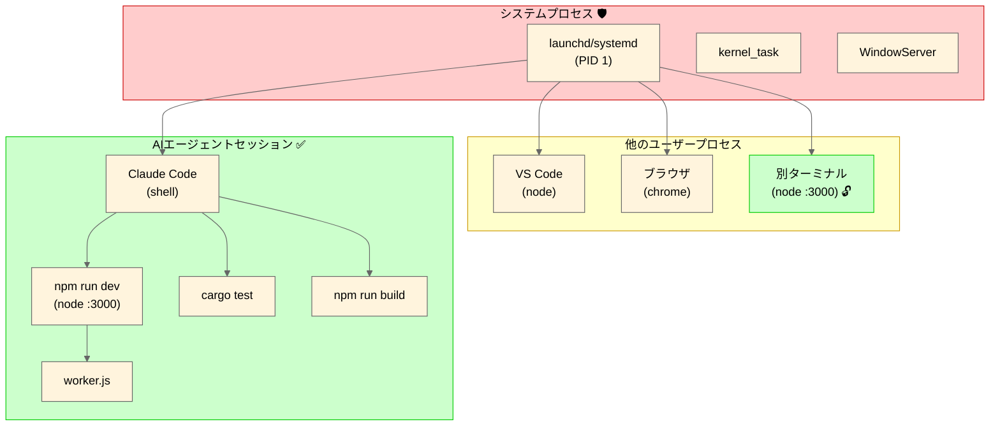

<h1 align="center">safe-kill</h1>

<p align="center">
  AI エージェント向けの、親子関係に基づくアクセス制御を備えた安全なプロセス終了ツール
</p>

<!-- standard:badges:start -->
<h3 align="center">対応プラットフォーム</h3>

<p align="center">
  
  
</p>

<p align="center">
  <a href="https://github.com/owayo/safe-kill/actions/workflows/ci.yml"></a>
  <a href="https://github.com/owayo/safe-kill/releases/latest"></a>
  <a href="LICENSE"></a>
</p>

<p align="center">
  <a href="README.md">English</a> |
  <a href="README.ja.md">日本語</a>
</p>
<!-- standard:badges:end -->

---

`safe-kill` は、AIエージェントがシステムプロセスや無関係なアプリケーションを誤って終了させることを防ぐCLIツールです。**親子関係に基づくアクセス制御**を強制し、エージェントのセッションから派生したプロセスのみを終了できます。

Claude Code などのエージェントに、`kill` / `pkill` / `killall` の代わりとして使わせます。対象は毎回、セッションのプロセスツリーとシステムプロセスの拒否リストに照らして判定し、シグナルを送る直前にも同じプロセスかどうかを確かめ直します。

## 機能

- **親子関係検証**: セッションから派生したプロセスのみ終了可能。親 PID が一致しても、祖先が同じプロセス一覧に存在しなければ拒否
- **自己破壊防止**: 自身や親プロセスの終了を防止。シグナル送信直前に最新の親 PID を OS から再取得して再検証し、判定～kill 間の再ペアレント（親の入れ替わり）にも fail-closed で対応
- **PID 1 保護**: PID 1（init/launchd、またはコンテナの独自エントリポイント）は allowlist 一致や `--port` 経路でも常に kill 対象外。コンテナ環境で PID 1 を巻き添えにしてコンテナ全体を落とすことを防ぐ
- **PID検証**: 危険なPID値（`0` と `i32::MAX` 超過）を拒否。シグナル送信直前の fresh なプロセス情報取得でも同じ境界を拒否
- **PID再利用検出**: シグナル送信直前に対象の同一性 (`pid + start_time + name`) を再検証し、ポリシー判定と `kill(2)` の間に発生する PID 再利用 (TOCTOU) を緩和
- **ポート保持の再検証**: `--port` 指定 kill では、シグナル送信直前に対象ポートを保持しているプロセス集合を再取得し、対象 PID/プロトコルが含まれない場合は `NoProcessOnPort` として fail-closed
- **端末制御文字のサニタイズ**: OS から取得したプロセス名・コマンドライン引数・エラーメッセージ本文・設定パスに含まれる ANSI escape・改行・C0/C1 制御文字・Unicode 17.0 の general category `Cf` に属する全 170 個の format 制御文字を `\xHH` または `\u{HHHH}` にエスケープしてから出力する。`--list` / kill 結果（`name` と `message` の両方）/ stderr のエラー出力（`safe-kill: ...`）/ `safe-kill init` のパス表示 / 設定読み込み警告 / clap の使用方法エラー（引数値をそのまま埋め込む）に適用し、表示行の上書き、端末状態の改ざん、双方向制御文字による表示順偽装を防ぐ
- **設定の fail-closed 読み込み**: 通常ファイルと通常ファイルへの symlink だけを受け入れ、壊れた symlink や特殊ファイルは解析前に拒否
- **設定の非公開権限**: `safe-kill init` は呼び出し元の `umask` が緩くても、設定ディレクトリを `0700`、新規設定ファイルを `0600` で作成
- **設定可能なリスト**: 許可リスト・拒否リストによる細かな制御
- **複数シグナル対応**: SIGTERM、SIGKILL、SIGHUPなど
- **ドライランモード**: 実際に終了せずにプレビュー
- **プロセス検出**: セッション内の終了可能なプロセス一覧表示
- **ポート指定クリーンアップ**: 設定済みの TCP リスナーまたは UDP ソケットをローカルポートで終了
- **決定的な処理順**: バッチ一致結果と終了可能プロセス一覧を PID 昇順にそろえ、出力を再現しやすくする
- **正確な失敗報告**: ポリシーチェック通過後の `ProcessNotFound` / `PermissionDenied` をそのまま返す

## インストール

<!-- standard:install:start -->
### Cargo

Rust 1.98 以上が必要です。

```bash
cargo install --git https://github.com/owayo/safe-kill --locked
```

### GitHub Releases から

[Releases](https://github.com/owayo/safe-kill/releases/latest) から自分の環境のアーカイブを取得して展開し、`safe-kill` を `PATH` の通った場所に置きます。各リリースには、取得したファイルを確かめるための `SHA256SUMS` も添付しています。

| プラットフォーム | ファイル |
|---|---|
| Linux (x86_64) | `safe-kill-x86_64-unknown-linux-gnu.tar.gz` |
| macOS (Intel) | `safe-kill-x86_64-apple-darwin.tar.gz` |
| macOS (Apple Silicon) | `safe-kill-aarch64-apple-darwin.tar.gz` |

macOS でブラウザから取得した場合は、実行の前に隔離属性を外します: `xattr -d com.apple.quarantine safe-kill`。

### ソースから

[mise](https://mise.jdx.dev/) が必要です (Rust のツールチェーンは `mise.toml` で固定しています)。

```bash
git clone https://github.com/owayo/safe-kill.git
cd safe-kill
make install
```

`make install` は `/usr/local/bin` に入れます。場所を変えるときは `INSTALL_PATH` を指定します (例: `make install INSTALL_PATH="$HOME/.local/bin"`)。
<!-- standard:install:end -->

## 使い方

```bash
# 終了可能なプロセス一覧
safe-kill --list

# PIDを指定して終了（SIGTERM、安全チェック付き）
safe-kill 12345

# 強制終了
safe-kill --signal SIGKILL 12345
safe-kill -s 9 12345

# セッション内のすべてのnodeプロセスを終了（名前の完全一致）
safe-kill --name node

# ポート3000を使う設定済み TCP リスナーまたは UDP ソケットを終了
safe-kill --port 3000

# ドライラン（実行せずにプレビュー）
safe-kill --name python --dry-run
```

`--name` は実行ファイル名の完全一致で判定し、`--port` は[設定](#設定)の `[allowed_ports]` に書いたポートにだけ使えます。終了コード 2 は常に「権限エラー」を表し、CLI の使用方法エラーはすべて 255 で終了します。全オプション・シグナル・終了コード・環境変数は [docs/cli-reference.ja.md](docs/cli-reference.ja.md) にまとめています。

### 終了できるプロセス


```mermaid
%%{init: {'theme': 'base', 'themeVariables': { 'lineColor': '#666666', 'primaryTextColor': '#000000', 'primaryBorderColor': '#666666' }}}%%
flowchart TB
    subgraph system["システムプロセス 🛡️"]
        init["launchd/systemd<br/>(PID 1)"]
        kernel["kernel_task"]
        window["WindowServer"]
    end

    subgraph other["他のユーザープロセス"]
        vscode["VS Code<br/>(node)"]
        browser["ブラウザ<br/>(chrome)"]
        otherdev["別ターミナル<br/>(node :3000) 🔓"]
    end

    subgraph session["AIエージェントセッション ✅"]
        shell["Claude Code<br/>(shell)"]
        shell --> server["npm run dev<br/>(node :3000)"]
        shell --> test["cargo test"]
        shell --> build["npm run build"]
        server --> worker["worker.js"]
    end

    init --> shell
    init --> vscode
    init --> browser
    init --> otherdev

    style system fill:#ffcccc,stroke:#cc0000,color:#000000
    style other fill:#ffffcc,stroke:#cc9900,color:#000000
    style session fill:#ccffcc,stroke:#00cc00,color:#000000
    style otherdev fill:#ccffcc,stroke:#00cc00,color:#000000
```

| プロセス | `--name`で終了 | `--port`で終了 | 理由 |
|---------|---------------------|----------------------|--------|
| `npm run dev` (:3000) | ✅ 可能 | ✅ 可能 | セッションの子孫 |
| `worker.js` | ✅ 可能 | - | セッションプロセスの子 |
| `cargo test` | ✅ 可能 | - | セッションの子孫 |
| 別ターミナル (:3000) | ❌ 不可 | ✅ 可能 | allowed_portsに含まれる（親子関係をバイパス） |
| VS Code (`node`) | ❌ 不可 | ❌ 不可 | 子孫ではない、許可ポートなし |
| ブラウザ | ❌ 不可 | ❌ 不可 | 子孫ではない |
| ルートセッションプロセス | ❌ 不可 | ❌ 不可 | 信頼ルート自体は子孫ではない |
| `launchd`/`systemd` | ❌ 不可 | ❌ 不可 | システムプロセス（拒否リスト） |

- `safe-kill --name node`: セッション内（緑のエリア）の `node` プロセスのみが終了。親子関係チェック必須。
- `safe-kill --port 3000`: ポート3000が `allowed_ports` に設定されていれば、自己破壊防止・拒否リスト・root PID 保護・ポート検証を維持したまま、**親子関係に関係なく** TCP リスナーまたは UDP ソケットを終了可能。別ターミナルで起動したままの開発サーバー等を終了する場合に便利。
- TCP のポート一致では `ESTABLISHED` などの非待ち受けソケットを無視するため、ローカルポートが一致しただけのクライアント接続は選択されません。
- `--port` オプションは `config.toml` での明示的な設定が必要です。設定がない場合、ポート指定でのkillは無効です。ポート `0` は範囲設定に含まれていても無効で、全有効ポートを許可する場合は `1-65535` を使います。
- `SAFE_KILL_ROOT_PID` は親子関係チェックの信頼ルートを変更しますが、その root PID 自体は保護されます。
- ポートを掴んでいる PID のプロセス情報が解決できない場合（検出後すぐに終了したケース等）、`safe-kill` は `pid:<pid>` のようなプレースホルダ名にフォールバックする代わりに `ProcessNotFound` で fail-closed します。これにより、実プロセス名が不明な状態で denylist 保護がバイパスされる事態を防ぎます。
- シグナル送信直前に対象ポートの保持者集合を再取得し、対象 PID が既にそのポートを離している場合は `NoProcessOnPort` として中止します。同一 PID が無関係な処理に切り替わっている場合に余計なシグナルを送らないための追加防御です。

この判定を支える構成要素と、14 の安全レイヤーは [docs/architecture.ja.md](docs/architecture.ja.md) で説明しています。

## 設定

`safe-kill` は `~/.config/safe-kill/config.toml` を読みます。このファイルが無い場合は、既定の拒否リストがシステムプロセスを保護し、`--port` は無効になります。`safe-kill init` でコメント付きのファイルを作るか（既存のファイルを確認なしで上書きするときは `--force`）、手で書いてください。

```toml
# 親子関係チェックをバイパスするプロセス（慎重に使用）
[allowlist]
processes = ["my-trusted-app", "next-server"]

# 追加で絶対に終了できないプロセス（許可リストより優先）
[denylist]
processes = ["postgres"]

# --port で対象にできるポート（単一ポートまたは範囲）
[allowed_ports]
ports = ["1420", "3000-3010", "5173", "8080"]
```

ユーザー定義の `[denylist]` は、システムプロセス（macOS の `launchd` や `WindowServer`、Linux の `systemd` や `sshd` など）を守る既定の保護に追加されます。カスタマイズしても、既定の保護は外れません。ファイルがあるのに読み込めない・解析できない場合や、未知のフィールドを含む場合は、既定値に戻さず設定エラーで止まります。各設定項目、既定の拒否リストの全体、`init` が書き出す内容は [docs/configuration.ja.md](docs/configuration.ja.md) を参照してください。

## Claude Code との連携

`.claude/settings.json` に `PreToolUse` フックを追加して `kill` / `pkill` / `killall` を止め、代わりに `safe-kill` を使うよう Claude に伝えます。あわせて `CLAUDE.md` にプロセス管理のルールを書いておきます。貼り付けるフックとルールは [docs/integrations.ja.md](docs/integrations.ja.md) にあります。

## 開発

<!-- standard:dev:start -->
[mise](https://mise.jdx.dev/) が必要です。ツールの版は `mise.toml` で固定しています。

```bash
make setup   # ツールチェーン (mise) と依存を取得する
make ci      # CI と同じ検査 (書き換えない)
```

| コマンド | 説明 |
|---|---|
| `make setup` | ツールチェーン (mise) と依存を取得する |
| `make build` | デバッグ版をビルドする |
| `make release` | リリース版をビルドする |
| `make run` | デバッグ版を実行する (引数は ARGS="...") |
| `make test` | テストを実行する |
| `make lint` | clippy を警告ゼロで通す |
| `make fmt` | コードを整形する (書き換える) |
| `make fmt-check` | 整形済みかを確かめる (書き換えない) |
| `make check` | 整形と静的検査 (書き換えない) |
| `make ci` | CI と同じ検査 (書き換えない) |
| `make install` | リリース版を INSTALL_PATH (既定 /usr/local/bin) に入れる |
| `make uninstall` | INSTALL_PATH から取り除く |
| `make clean` | ビルド成果物を消す |

`make` でターゲットの一覧を表示します。リリースは GitHub Actions で行います (**Actions → Release → Run workflow**)。
<!-- standard:dev:end -->

テストの構成と、一部のテストだけを実行する方法は [docs/development.ja.md](docs/development.ja.md) にあります。

セキュリティ脆弱性を発見した場合は、[GitHub Issues](https://github.com/owayo/safe-kill/issues) で報告してください。

## ライセンス

<!-- standard:license:start -->
[MIT](LICENSE)
<!-- standard:license:end -->
