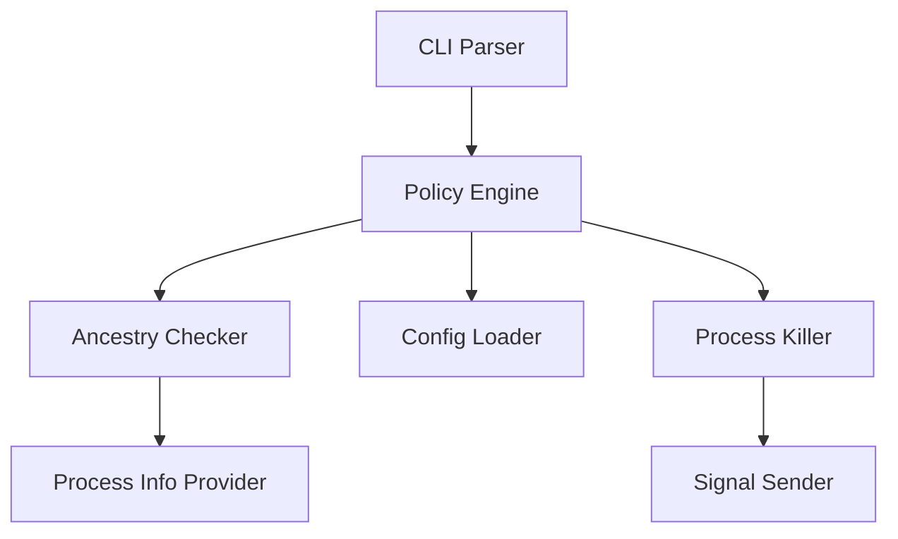
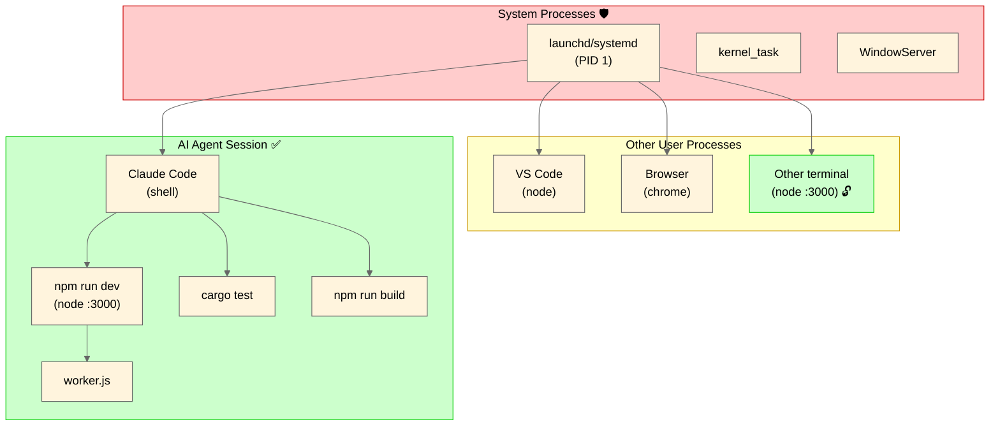

<h1 align="center">safe-kill</h1>

<p align="center">
  <strong>Safe process termination for AI agents with ancestry-based access control</strong>
</p>

<p align="center">
  <a href="https://github.com/owayo/safe-kill/actions/workflows/ci.yml">
    
  </a>
  <a href="https://github.com/owayo/safe-kill/releases/latest">
    
  </a>
  <a href="LICENSE">
    
  </a>
</p>

<p align="center">
  <a href="README.md">English</a> |
  <a href="README.ja.md">日本語</a>
</p>

---

## Overview

`safe-kill` is a CLI tool that prevents AI agents from accidentally killing system processes or unrelated applications. It enforces **ancestry-based access control** — only processes that are descendants of the agent's session can be terminated.

## Features

- **Ancestry Verification**: Only kill processes spawned by your session
- **Suicide Prevention**: Cannot kill self or parent processes
- **PID Validation**: Rejects unsafe PID values (`0` and values beyond `i32::MAX`)
- **PID Reuse Detection**: Re-validates target identity (`pid + start_time + name`) immediately before signaling, mitigating TOCTOU between policy decision and `kill(2)`
- **Port Hold Re-check**: For `--port` kills, the live port-holder set is re-queried just before signaling; if the target released the port, the kill is aborted as `NoProcessOnPort`
- **Configurable Lists**: Allowlist and denylist for fine-grained control
- **Multiple Signals**: Support for SIGTERM, SIGKILL, SIGHUP, and more
- **Dry-run Mode**: Preview what would be killed without taking action
- **Process Discovery**: List all killable processes in your session
- **Port-based Cleanup**: Kill configured TCP listeners or UDP sockets by local port
- **Deterministic Ordering**: Sort batch matches and killable process lists by PID for reproducible output
- **Accurate Failure Reporting**: Preserve `ProcessNotFound` / `PermissionDenied` when signal dispatch fails after policy checks

## Requirements

- **OS**: macOS, Linux
- **Rust**: 1.85+ (for building from source)

## Installation

### From Source

```bash
cargo install --path .
```

### Binary Download

Download the latest release from [Releases](https://github.com/owayo/safe-kill/releases).

## Quickstart

```bash
# List all killable processes
safe-kill --list

# Kill a process by PID (with safety checks)
safe-kill 12345

# Kill processes by name
safe-kill --name node

# Preview without killing (dry-run)
safe-kill --name python --dry-run
```

## Usage

### Commands

```bash
safe-kill [OPTIONS] [PID]
safe-kill init [--force]
```

`init` is a standalone subcommand. It cannot be combined with `PID`, `--name`, `--port`, `--list`, `--signal`, or `--dry-run`.

### Options

| Option | Short | Description |
|--------|-------|-------------|
| `--name <NAME>` | `-N` | Kill processes by exact process name |
| `--port <PORT>` | `-p` | Kill configured TCP listener or UDP socket using the specified port (`1`-`65535`; `0` is rejected) |
| `--signal <SIGNAL>` | `-s` | Signal to send (default: SIGTERM) |
| `--list` | `-l` | List killable processes |
| `--dry-run` | `-n` | Preview without sending signals |
| `--help` | `-h` | Show help |
| `--version` | `-V` | Show version |

### Signals

Supported signals can be specified by name or number:

| Signal | Number | Description |
|--------|--------|-------------|
| SIGTERM | 15 | Graceful termination (default) |
| SIGKILL | 9 | Force kill |
| SIGHUP | 1 | Hangup |
| SIGINT | 2 | Interrupt |
| SIGQUIT | 3 | Quit |
| SIGUSR1 | 10 (Linux) / 30 (macOS) | User-defined signal 1 (platform-native number only) |
| SIGUSR2 | 12 (Linux) / 31 (macOS) | User-defined signal 2 (platform-native number only) |

### Examples

```bash
# Graceful termination
safe-kill 12345

# Force kill
safe-kill --signal SIGKILL 12345
safe-kill -s 9 12345

# Kill all node processes in session
safe-kill --name node

# Kill the configured TCP listener or UDP socket using port 3000
safe-kill --port 3000

# List what would be killed
safe-kill --name python --dry-run
```

For `--name` and `--port` dry runs, batch summaries use `would kill` so preview output is not mistaken for an actual termination.

`--name` matches the executable name exactly. It does not perform substring or pattern matching.

When multiple processes match `--name`, results are processed and displayed in ascending PID order so repeated runs stay stable.

`--port` targets TCP sockets only when they are in `LISTEN` state. Established TCP client sockets with the same local port are ignored. UDP has no connection state, so UDP matches use the local port. Port `0` is always rejected because it is an OS auto-assignment sentinel, not a kill target.

### Error Handling

If a process matched policy checks but disappeared before signal delivery, or the OS rejected the signal, `safe-kill` returns the original runtime error such as `ProcessNotFound` or `PermissionDenied` instead of collapsing it into `NoKillableTarget`.

## Configuration

Initialize configuration with `safe-kill init`, or create `~/.config/safe-kill/config.toml` manually:

```toml
# Processes that bypass ancestry checks (use with caution)
[allowlist]
processes = ["my-trusted-app", "next-server"]

# Additional processes that can never be killed (takes precedence over allowlist)
# Built-in system protections stay enabled even when you customize this list.
[denylist]
processes = ["postgres"]

# Allowed ports for --port option
# If not specified, --port option is disabled (no ports can be killed)
# Valid values are 1-65535. Port 0 is always rejected even if configured.
[allowed_ports]
ports = ["1420", "3000-3010", "5173", "8080"]
#   - 1420: Tauri dev server
#   - 3000-3010: Node.js dev servers
#   - 5173: Vite dev server
#   - 8080: HTTP alternative port
```

### Default Denylist

The following system processes are protected by default:

**macOS**: `launchd`, `kernel_task`, `WindowServer`, `loginwindow`, `Finder`, `Dock`, `SystemUIServer`

**Linux**: `systemd`, `init`, `kthreadd`, `dbus-daemon`, `gnome-shell`, `Xorg`, `sshd`

User-defined `[denylist]` entries are appended to this built-in protection set. Customizing the list does not remove system safeguards.

If `config.toml` exists but cannot be accessed, read, or parsed, or if it contains unknown fields, kill/list commands fail with a configuration error instead of falling back to partial defaults. This prevents a malformed custom denylist from being ignored during process termination.

## Architecture


```mermaid
flowchart TB
    CLI[CLI Parser] --> Policy[Policy Engine]
    Policy --> Ancestry[Ancestry Checker]
    Policy --> Config[Config Loader]
    Policy --> Killer[Process Killer]
    Ancestry --> ProcInfo[Process Info Provider]
    Killer --> Signal[Signal Sender]
```

### Safety Layers

1. **Suicide Prevention**: Cannot kill own process or parent
2. **PID Validation**: Reject unsafe PID values (`0`, out-of-range) before signal dispatch
3. **Denylist Check**: System processes are always protected
4. **Root PID Protection**: The trust root itself is not killable, even if allowlisted
5. **Allowlist Bypass**: Trusted processes can skip ancestry checks
6. **Ancestry Verification**: Only descendants of root session are killable
7. **PID Reuse Detection (TOCTOU mitigation)**: Re-validates `pid + start_time + name` immediately before `kill(2)`. If the OS has reused the PID for another process between policy decision and signal dispatch, the kill fails closed with `ProcessNotFound`. The `start_time` granularity is seconds, so reuse to a same-named process within the same second cannot be detected (extremely rare in practice). Full coverage would require Linux `pidfd_open` + `pidfd_send_signal`.
8. **Port Hold Re-check (port mode only)**: For `--port` kills, the set of current holders of the target port is re-queried just before signaling. If the candidate PID/protocol is no longer present in that set (the target released the port between policy decision and `kill(2)`), the kill fails closed with `NoProcessOnPort`. This avoids killing a now-unrelated workload that happens to share the same PID after the user's intent (releasing the port) has already been satisfied.

### Process Tree and Killable Scope


```mermaid
%%{init: {'theme': 'base', 'themeVariables': { 'lineColor': '#666666', 'primaryTextColor': '#000000', 'primaryBorderColor': '#666666' }}}%%
flowchart TB
    subgraph system["System Processes 🛡️"]
        init["launchd/systemd<br/>(PID 1)"]
        kernel["kernel_task"]
        window["WindowServer"]
    end

    subgraph other["Other User Processes"]
        vscode["VS Code<br/>(node)"]
        browser["Browser<br/>(chrome)"]
        otherdev["Other terminal<br/>(node :3000) 🔓"]
    end

    subgraph session["AI Agent Session ✅"]
        shell["Claude Code<br/>(shell)"]
        shell --> server["npm run dev<br/>(node :3000)"]
        shell --> test["cargo test"]
        shell --> build["npm run build"]
        server --> worker["worker.js"]
    end

    init --> shell
    init --> vscode
    init --> browser
    init --> otherdev

    style system fill:#ffcccc,stroke:#cc0000,color:#000000
    style other fill:#ffffcc,stroke:#cc9900,color:#000000
    style session fill:#ccffcc,stroke:#00cc00,color:#000000
    style otherdev fill:#ccffcc,stroke:#00cc00,color:#000000
```

| Process | Killable by `--name` | Killable by `--port` | Reason |
|---------|---------------------|----------------------|--------|
| `npm run dev` (:3000) | ✅ Yes | ✅ Yes | Descendant of session |
| `worker.js` | ✅ Yes | - | Child of session process |
| `cargo test` | ✅ Yes | - | Descendant of session |
| Other terminal (:3000) | ❌ No | ✅ Yes | Port in allowed_ports (bypasses ancestry) |
| VS Code (`node`) | ❌ No | ❌ No | Not a descendant, no allowed port |
| Browser | ❌ No | ❌ No | Not a descendant |
| Root session process | ❌ No | ❌ No | Trust root is not a descendant target |
| `launchd`/`systemd` | ❌ No | ❌ No | System process (denylist) |

**Key Points**:
- `safe-kill --name node`: Only `node` processes within your session (green area) are terminated. Requires ancestry check.
- `safe-kill --port 3000`: Kills a TCP listener or UDP socket using port 3000 **regardless of ancestry** if port is in `allowed_ports`, while still respecting suicide, denylist, root PID, and port validation protections. Useful for killing orphaned dev servers started in other terminals.
- TCP port matching ignores `ESTABLISHED` and other non-listening sockets so client connections are not selected just because their local port matches.
- `--port` option requires explicit configuration in `config.toml`. Without it, port-based killing is disabled. Port `0` is invalid even when a configured range includes it; use `1-65535` for a full valid range.
- `SAFE_KILL_ROOT_PID` changes the trust root for ancestry checks, but that root PID itself remains protected.
- When the process information for a port-bound PID cannot be resolved (e.g., the process exited between detection and policy check), `safe-kill` fails closed with `ProcessNotFound` instead of falling back to a placeholder name like `pid:<pid>`. This prevents denylist bypass when the real process name is unavailable.
- Immediately before signaling, the live port-holder set is re-queried. If the target PID is no longer holding the port (e.g., the dev server already exited), the kill is aborted as `NoProcessOnPort` so that a same-PID process now doing unrelated work is not signaled.

## Exit Codes

| Code | Meaning |
|------|---------|
| 0 | Success |
| 1 | No target found (no name match, no process on allowed port, or no killable match) |
| 2 | Permission denied |
| 3 | Configuration error |
| 4 | Port not allowed |
| 255 | General error (invalid signal/port, suicide attempt, etc.) |

## Environment Variables

| Variable | Description |
|----------|-------------|
| `SAFE_KILL_ROOT_PID` | Override root PID for ancestry checks (`0` or invalid values are ignored; the root PID itself is not killable) |

## Claude Code Integration

Configure `safe-kill` as a safer alternative to `kill`/`pkill` commands in Claude Code.

### 1. Hook Configuration

Add to `.claude/settings.json`:

```json
{
  "hooks": {
    "PreToolUse": [
      {
        "matcher": "Bash",
        "hooks": [
          {
            "type": "command",
            "command": "if echo \"$TOOL_INPUT\" | grep -qE '(^|[;&|])\\s*(kill|pkill|killall)\\s'; then echo '🚫 Use safe-kill instead: safe-kill <PID> or safe-kill --name <exact-name>. Use -s <signal> for signal.' >&2; exit 2; fi"
          }
        ]
      }
    ]
  }
}
```

When a `kill`/`pkill`/`killall` command is detected, the hook outputs a message to stderr and exits with code 2, which blocks the tool call and shows the message to Claude.

### 2. CLAUDE.md Instructions

Add to your `CLAUDE.md`:

```markdown
## Process Management Rules

- Do NOT use `kill`, `pkill`, or `killall`. These are restricted for safety.
- Use `safe-kill <PID>`, `safe-kill --name <PROCESS_NAME>`, or `safe-kill --port <PORT>` to terminate processes.
- `safe-kill` will automatically verify that the target process is a child of your session.
- If `safe-kill` fails, the process is likely not owned by you.

### Examples
- Terminate a test server: `safe-kill --name node`
- Terminate a process using port 3000: `safe-kill --port 3000`
- Force kill a stuck process: `safe-kill -s 9 <PID>`
- Preview what would be killed: `safe-kill --name python --dry-run`
```

## Development

```bash
# Build
cargo build

# Run tests
cargo test

# Build release
cargo build --release
```

### Test Coverage

- **Library Unit Tests**: 348 tests covering all modules
- **Binary Unit Tests**: 26 tests for CLI output utilities and version checks
- **Integration Tests**: 78 tests with real process trees
- **E2E Tests**: 83 tests for CLI behavior

## Contributing

Contributions are welcome! Please feel free to submit a Pull Request.

## Security

If you discover a security vulnerability, please report it via [GitHub Issues](https://github.com/owayo/safe-kill/issues).

## License

[MIT](LICENSE)
