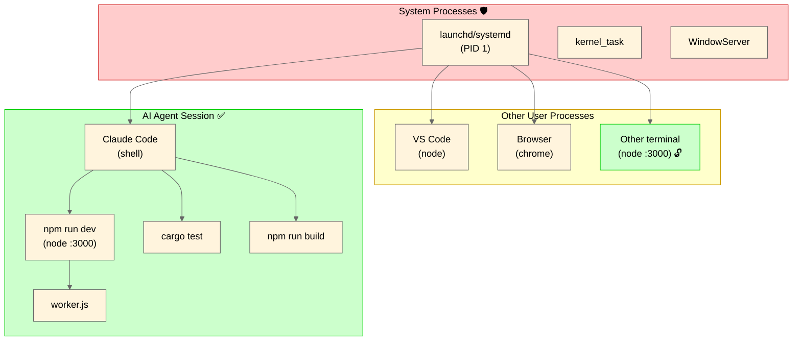

<h1 align="center">safe-kill</h1>

<p align="center">
  Safe process termination for AI agents with ancestry-based access control
</p>

<!-- standard:badges:start -->
<h3 align="center">Supported Platforms</h3>

<p align="center">
  
  
</p>

<p align="center">
  <a href="https://github.com/owayo/safe-kill/actions/workflows/ci.yml"></a>
  <a href="https://github.com/owayo/safe-kill/releases/latest"></a>
  <a href="LICENSE"></a>
</p>

<p align="center">
  <a href="README.md">English</a> |
  <a href="README.ja.md">日本語</a>
</p>
<!-- standard:badges:end -->

---

`safe-kill` is a CLI tool that prevents AI agents from accidentally killing system processes or unrelated applications. It enforces **ancestry-based access control** — only processes that are descendants of the agent's session can be terminated.

It takes the place of `kill` / `pkill` / `killall` for agents such as Claude Code. Every target is checked against the session's process tree and a denylist of system processes, and its identity is checked again right before the signal is sent.

## Features

- **Ancestry Verification**: Only kill processes spawned by your session
- **Suicide Prevention**: Cannot kill self or parent processes; the current parent PID is re-resolved from the OS immediately before signaling, failing closed even if the process was re-parented between the policy decision and the kill
- **PID 1 Protection**: PID 1 (init/launchd, or a custom container entrypoint) is never killable — even via allowlist match or `--port` bypass — so containerized agents cannot accidentally take down the whole container
- **PID Validation**: Rejects unsafe PID values (`0` and values beyond `i32::MAX`), including in the fresh process lookup used immediately before signaling
- **PID Reuse Detection**: Re-validates target identity (`pid + start_time + name`) immediately before signaling, mitigating TOCTOU between policy decision and `kill(2)`
- **Port Hold Re-check**: For `--port` kills, the live port-holder set is re-queried just before signaling; if the target released the port, the kill is aborted as `NoProcessOnPort`
- **Terminal Output Sanitization**: ANSI escape sequences, newlines, C0/C1 controls, and all 170 Unicode 17.0 general-category `Cf` format controls in process names, argv, error message bodies, and config paths are escaped (`\xHH` or `\u{HHHH}`) before printing. This covers `--list`, kill result lines (both `name` and `message`), the stderr error path (`safe-kill: ...`), `safe-kill init` path output, config-load warnings, and clap usage errors (which embed the offending argument verbatim).
- **Fail-closed Config Loading**: Accepts regular config files and symlinks to regular files, but rejects dangling symlinks and special files before parsing
- **Private Config Creation**: `safe-kill init` creates its configuration directory with mode `0700` and a new config file with mode `0600`, even under a permissive `umask`
- **Configurable Lists**: Allowlist and denylist for fine-grained control
- **Multiple Signals**: Support for SIGTERM, SIGKILL, SIGHUP, and more
- **Dry-run Mode**: Preview what would be killed without taking action
- **Process Discovery**: List all killable processes in your session
- **Port-based Cleanup**: Kill configured TCP listeners or UDP sockets by local port
- **Deterministic Ordering**: Sort batch matches and killable process lists by PID for reproducible output
- **Accurate Failure Reporting**: Preserve `ProcessNotFound` / `PermissionDenied` when signal dispatch fails after policy checks

## Installation

<!-- standard:install:start -->
### Cargo

Requires Rust 1.98 or later.

```bash
cargo install --git https://github.com/owayo/safe-kill --locked
```

### From GitHub Releases

Download the archive for your platform from [Releases](https://github.com/owayo/safe-kill/releases/latest), extract it, and put `safe-kill` on your `PATH`. Each release also includes `SHA256SUMS` for checking the downloads.

| Platform | Archive |
|---|---|
| Linux (x86_64) | `safe-kill-x86_64-unknown-linux-gnu.tar.gz` |
| macOS (Intel) | `safe-kill-x86_64-apple-darwin.tar.gz` |
| macOS (Apple Silicon) | `safe-kill-aarch64-apple-darwin.tar.gz` |

On macOS, if you downloaded the archive with a browser, remove the quarantine attribute before running it: `xattr -d com.apple.quarantine safe-kill`.

### From Source

Requires [mise](https://mise.jdx.dev/) (the Rust toolchain is pinned in `mise.toml`).

```bash
git clone https://github.com/owayo/safe-kill.git
cd safe-kill
make install
```

`make install` installs to `/usr/local/bin`. Set `INSTALL_PATH` to change it (for example `make install INSTALL_PATH="$HOME/.local/bin"`).
<!-- standard:install:end -->

## Usage

```bash
# List all killable processes
safe-kill --list

# Kill a process by PID (SIGTERM, with safety checks)
safe-kill 12345

# Force kill
safe-kill --signal SIGKILL 12345
safe-kill -s 9 12345

# Kill all node processes in your session (exact name match)
safe-kill --name node

# Kill the configured TCP listener or UDP socket using port 3000
safe-kill --port 3000

# Preview without killing (dry-run)
safe-kill --name python --dry-run
```

`--name` matches the executable name exactly, and `--port` works only for ports listed in `[allowed_ports]` of the [configuration](#configuration). Exit code 2 always means "permission denied", and every CLI usage error exits with 255. All options, signals, exit codes, and environment variables: [docs/cli-reference.md](docs/cli-reference.md)

### What Can Be Killed


```mermaid
%%{init: {'theme': 'base', 'themeVariables': { 'lineColor': '#666666', 'primaryTextColor': '#000000', 'primaryBorderColor': '#666666' }}}%%
flowchart TB
    subgraph system["System Processes 🛡️"]
        init["launchd/systemd<br/>(PID 1)"]
        kernel["kernel_task"]
        window["WindowServer"]
    end

    subgraph other["Other User Processes"]
        vscode["VS Code<br/>(node)"]
        browser["Browser<br/>(chrome)"]
        otherdev["Other terminal<br/>(node :3000) 🔓"]
    end

    subgraph session["AI Agent Session ✅"]
        shell["Claude Code<br/>(shell)"]
        shell --> server["npm run dev<br/>(node :3000)"]
        shell --> test["cargo test"]
        shell --> build["npm run build"]
        server --> worker["worker.js"]
    end

    init --> shell
    init --> vscode
    init --> browser
    init --> otherdev

    style system fill:#ffcccc,stroke:#cc0000,color:#000000
    style other fill:#ffffcc,stroke:#cc9900,color:#000000
    style session fill:#ccffcc,stroke:#00cc00,color:#000000
    style otherdev fill:#ccffcc,stroke:#00cc00,color:#000000
```

| Process | Killable by `--name` | Killable by `--port` | Reason |
|---------|---------------------|----------------------|--------|
| `npm run dev` (:3000) | ✅ Yes | ✅ Yes | Descendant of session |
| `worker.js` | ✅ Yes | - | Child of session process |
| `cargo test` | ✅ Yes | - | Descendant of session |
| Other terminal (:3000) | ❌ No | ✅ Yes | Port in allowed_ports (bypasses ancestry) |
| VS Code (`node`) | ❌ No | ❌ No | Not a descendant, no allowed port |
| Browser | ❌ No | ❌ No | Not a descendant |
| Root session process | ❌ No | ❌ No | Trust root is not a descendant target |
| `launchd`/`systemd` | ❌ No | ❌ No | System process (denylist) |

- `safe-kill --name node`: Only `node` processes within your session (green area) are terminated. Requires ancestry check.
- `safe-kill --port 3000`: Kills a TCP listener or UDP socket using port 3000 **regardless of ancestry** if port is in `allowed_ports`, while still respecting suicide, denylist, root PID, and port validation protections. Useful for killing orphaned dev servers started in other terminals.
- TCP port matching ignores `ESTABLISHED` and other non-listening sockets so client connections are not selected just because their local port matches.
- `--port` option requires explicit configuration in `config.toml`. Without it, port-based killing is disabled. Port `0` is invalid even when a configured range includes it; use `1-65535` for a full valid range.
- `SAFE_KILL_ROOT_PID` changes the trust root for ancestry checks, but that root PID itself remains protected.
- When the process information for a port-bound PID cannot be resolved (e.g., the process exited between detection and policy check), `safe-kill` fails closed with `ProcessNotFound` instead of falling back to a placeholder name like `pid:<pid>`. This prevents denylist bypass when the real process name is unavailable.
- Immediately before signaling, the live port-holder set is re-queried. If the target PID is no longer holding the port (e.g., the dev server already exited), the kill is aborted as `NoProcessOnPort` so that a same-PID process now doing unrelated work is not signaled.

The components and the 14 safety layers behind these rules: [docs/architecture.md](docs/architecture.md)

## Configuration

`safe-kill` reads `~/.config/safe-kill/config.toml`. Without the file, the default denylist protects system processes and `--port` is disabled. `safe-kill init` creates a commented file (use `--force` to overwrite an existing one without the prompt), or you can write it by hand:

```toml
# Processes that bypass ancestry checks (use with caution)
[allowlist]
processes = ["my-trusted-app", "next-server"]

# Additional processes that can never be killed (takes precedence over allowlist)
[denylist]
processes = ["postgres"]

# Ports that --port may target (single ports or ranges)
[allowed_ports]
ports = ["1420", "3000-3010", "5173", "8080"]
```

User-defined `[denylist]` entries are added to the built-in protection of system processes (such as `launchd` and `WindowServer` on macOS, `systemd` and `sshd` on Linux); customizing the list never removes it. If the file exists but cannot be read or parsed, or contains unknown fields, `safe-kill` stops with a configuration error instead of falling back to defaults. Every setting, the full default denylist, and what `init` writes: [docs/configuration.md](docs/configuration.md)

## Claude Code Integration

Add a `PreToolUse` hook to `.claude/settings.json` that blocks `kill` / `pkill` / `killall` and tells Claude to use `safe-kill` instead, then add process management rules to your `CLAUDE.md`. The hook and the rules to paste: [docs/integrations.md](docs/integrations.md)

## Development

<!-- standard:dev:start -->
Requires [mise](https://mise.jdx.dev/). Tool versions are pinned in `mise.toml`.

```bash
make setup   # Install the toolchain (mise) and dependencies
make ci      # Run the same checks as CI (no changes)
```

| Command | Description |
|---|---|
| `make setup` | Install the toolchain (mise) and dependencies |
| `make build` | Build a debug binary |
| `make release` | Build a release binary |
| `make run` | Run the debug binary (arguments via ARGS="...") |
| `make test` | Run the tests |
| `make lint` | Run clippy with warnings as errors |
| `make fmt` | Format the code (rewrites files) |
| `make fmt-check` | Check the formatting (no changes) |
| `make check` | Run fmt-check and lint (no changes) |
| `make ci` | Run the same checks as CI (no changes) |
| `make install` | Install the release binary to INSTALL_PATH (default /usr/local/bin) |
| `make uninstall` | Remove the binary from INSTALL_PATH |
| `make clean` | Remove build artifacts |

Run `make` to list every target. Releases are published from GitHub Actions (**Actions → Release → Run workflow**).
<!-- standard:dev:end -->

The test suite and how to run part of it: [docs/development.md](docs/development.md)

If you discover a security vulnerability, please report it via [GitHub Issues](https://github.com/owayo/safe-kill/issues).

## License

<!-- standard:license:start -->
[MIT](LICENSE)
<!-- standard:license:end -->
