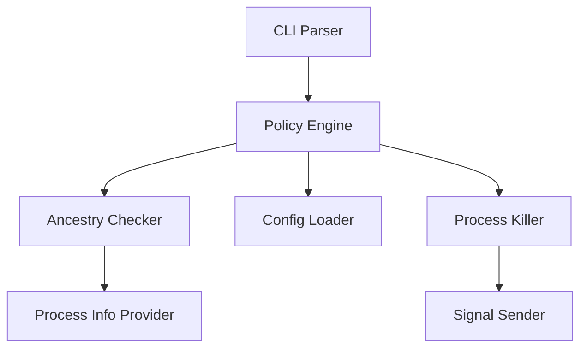
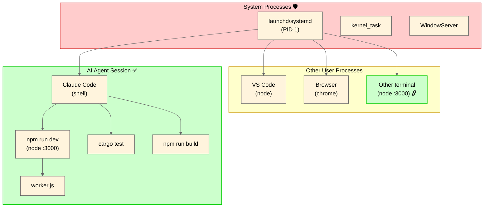

<h1 align="center">safe-kill</h1>

<p align="center">
  <strong>Safe process termination for AI agents with ancestry-based access control</strong>
</p>

<p align="center">
  <a href="https://github.com/owayo/safe-kill/actions/workflows/ci.yml">
    
  </a>
  <a href="https://github.com/owayo/safe-kill/releases/latest">
    
  </a>
  <a href="LICENSE">
    
  </a>
</p>

<p align="center">
  <a href="README.md">English</a> |
  <a href="README.ja.md">日本語</a>
</p>

---

## Overview

`safe-kill` is a CLI tool that prevents AI agents from accidentally killing system processes or unrelated applications. It enforces **ancestry-based access control** — only processes that are descendants of the agent's session can be terminated.

## Features

- **Ancestry Verification**: Only kill processes spawned by your session
- **Suicide Prevention**: Cannot kill self or parent processes; the current parent PID is re-resolved from the OS immediately before signaling, failing closed even if the process was re-parented between the policy decision and the kill
- **PID 1 Protection**: PID 1 (init/launchd, or a custom container entrypoint) is never killable — even via allowlist match or `--port` bypass — so containerized agents cannot accidentally take down the whole container
- **PID Validation**: Rejects unsafe PID values (`0` and values beyond `i32::MAX`), including in the fresh process lookup used immediately before signaling
- **PID Reuse Detection**: Re-validates target identity (`pid + start_time + name`) immediately before signaling, mitigating TOCTOU between policy decision and `kill(2)`
- **Port Hold Re-check**: For `--port` kills, the live port-holder set is re-queried just before signaling; if the target released the port, the kill is aborted as `NoProcessOnPort`
- **Terminal Output Sanitization**: ANSI escape sequences, newlines, C0/C1 controls, and all 170 Unicode 17.0 general-category `Cf` format controls in process names, argv, error message bodies, and config paths are escaped (`\xHH` or `\u{HHHH}`) before printing. This covers `--list`, kill result lines (both `name` and `message`), the stderr error path (`safe-kill: ...`), `safe-kill init` path output, and config-load warnings.
- **Fail-closed Config Loading**: Accepts regular config files and symlinks to regular files, but rejects dangling symlinks and special files before parsing
- **Private Config Creation**: `safe-kill init` creates its configuration directory with mode `0700` and a new config file with mode `0600`, even under a permissive `umask`
- **Configurable Lists**: Allowlist and denylist for fine-grained control
- **Multiple Signals**: Support for SIGTERM, SIGKILL, SIGHUP, and more
- **Dry-run Mode**: Preview what would be killed without taking action
- **Process Discovery**: List all killable processes in your session
- **Port-based Cleanup**: Kill configured TCP listeners or UDP sockets by local port
- **Deterministic Ordering**: Sort batch matches and killable process lists by PID for reproducible output
- **Accurate Failure Reporting**: Preserve `ProcessNotFound` / `PermissionDenied` when signal dispatch fails after policy checks

## Requirements

- **OS**: macOS, Linux
- **Rust**: 1.85+ (for building from source)

## Installation

### From Source

```bash
cargo install --path .
```

### Binary Download

Download the latest release from [Releases](https://github.com/owayo/safe-kill/releases).

## Quickstart

```bash
# List all killable processes
safe-kill --list

# Kill a process by PID (with safety checks)
safe-kill 12345

# Kill processes by name
safe-kill --name node

# Preview without killing (dry-run)
safe-kill --name python --dry-run
```

## Usage

### Commands

```bash
safe-kill [OPTIONS] [PID]
safe-kill init [--force]
```

`init` is a standalone subcommand. It cannot be combined with `PID`, `--name`, `--port`, `--list`, `--signal`, or `--dry-run`.

If the config file already exists, `init` prompts for confirmation before overwriting (use `--force` to skip the prompt). Declining the prompt leaves the existing file unchanged and exits successfully (code 0); only an actual write failure is reported as a configuration error (code 3).

Symlinked config files (the common dotfiles pattern, `~/.config/safe-kill/config.toml -> ~/dotfiles/safe-kill.toml`) keep working: `init` follows the link and updates the real file, leaving the symlink intact. Because the file it rewrites is *not* the path you typed, both the confirmation prompt and the success line disclose the resolved target. A **dangling** symlink is refused outright (code 3, even with `--force`) rather than silently creating a file at the link target.

`init` accepts only regular files (or symlinks that resolve to regular files). Directories, FIFOs, devices, and symlinks to those special files are rejected before opening, so `--force` cannot block on a FIFO or write to a device. The validated parent directory is pinned by file descriptor after checking its device/inode, and the destination is opened relative to that descriptor with non-blocking, no-symlink-following flags. The opened file's device/inode is also checked before truncation. A replacement before open therefore fails closed; after open, the pinned descriptor prevents a later path change from redirecting the write to another file.

For a new configuration, `init` creates `~/.config/safe-kill` with mode `0700` and `config.toml` with mode `0600`. These are explicit upper bounds, so a permissive caller `umask` cannot make the authorization settings writable by another user; a stricter `umask` remains effective.

### Options

| Option | Short | Description |
|--------|-------|-------------|
| `--name <NAME>` | `-N` | Kill processes by exact process name |
| `--port <PORT>` | `-p` | Kill configured TCP listener or UDP socket using the specified port (`1`-`65535`; `0` is rejected) |
| `--signal <SIGNAL>` | `-s` | Signal to send (default: SIGTERM) |
| `--list` | `-l` | List killable processes |
| `--dry-run` | `-n` | Preview without sending signals |
| `--help` | `-h` | Show help |
| `--version` | `-V` | Show version |

### Signals

Supported signals can be specified by name or number:

| Signal | Number | Description |
|--------|--------|-------------|
| SIGTERM | 15 | Graceful termination (default) |
| SIGKILL | 9 | Force kill |
| SIGHUP | 1 | Hangup |
| SIGINT | 2 | Interrupt |
| SIGQUIT | 3 | Quit |
| SIGUSR1 | 10 (Linux) / 30 (macOS) | User-defined signal 1 (platform-native number only) |
| SIGUSR2 | 12 (Linux) / 31 (macOS) | User-defined signal 2 (platform-native number only) |

### Examples

```bash
# Graceful termination
safe-kill 12345

# Force kill
safe-kill --signal SIGKILL 12345
safe-kill -s 9 12345

# Kill all node processes in session
safe-kill --name node

# Kill the configured TCP listener or UDP socket using port 3000
safe-kill --port 3000

# List what would be killed
safe-kill --name python --dry-run
```

For `--name` and `--port` dry runs, batch summaries use `would kill` so preview output is not mistaken for an actual termination.

`--name` matches the executable name exactly. It does not perform substring or pattern matching.

When multiple processes match `--name`, results are processed and displayed in ascending PID order so repeated runs stay stable.

`--port` targets TCP sockets only when they are in `LISTEN` state. Established TCP client sockets with the same local port are ignored. UDP has no connection state, so UDP matches use the local port. Port `0` is always rejected because it is an OS auto-assignment sentinel, not a kill target.

### Error Handling

If a process matched policy checks but disappeared before signal delivery, or the OS rejected the signal, `safe-kill` returns the original runtime error such as `ProcessNotFound` or `PermissionDenied` instead of collapsing it into `NoKillableTarget`.

## Configuration

Initialize configuration with `safe-kill init`, or create `~/.config/safe-kill/config.toml` manually:

```toml
# Processes that bypass ancestry checks (use with caution)
[allowlist]
processes = ["my-trusted-app", "next-server"]

# Additional processes that can never be killed (takes precedence over allowlist)
# Built-in system protections stay enabled even when you customize this list.
[denylist]
processes = ["postgres"]

# Allowed ports for --port option
# If not specified, --port option is disabled (no ports can be killed)
# Valid values are 1-65535. Port 0 is always rejected even if configured.
[allowed_ports]
ports = ["1420", "3000-3010", "5173", "8080"]
#   - 1420: Tauri dev server
#   - 3000-3010: Node.js dev servers
#   - 5173: Vite dev server
#   - 8080: HTTP alternative port
```

### Default Denylist

The following system processes are protected by default:

**macOS**: `launchd`, `kernel_task`, `WindowServer`, `loginwindow`, `Finder`, `Dock`, `SystemUIServer`

**Linux**: `systemd`, `init`, `kthreadd`, `dbus-daemon`, `gnome-shell`, `Xorg`, `sshd`

User-defined `[denylist]` entries are appended to this built-in protection set. Customizing the list does not remove system safeguards.

If `config.toml` exists but cannot be accessed, read, or parsed, or if it contains unknown fields, kill/list commands fail with a configuration error instead of falling back to partial defaults. Regular files and symlinks that resolve to regular files are accepted. Dangling symlinks and paths that resolve to directories, FIFOs, or devices are rejected before reading; this prevents a missing managed config from silently disabling custom protections and avoids blocking or unbounded reads from special files.

## Architecture


```mermaid
flowchart TB
    CLI[CLI Parser] --> Policy[Policy Engine]
    Policy --> Ancestry[Ancestry Checker]
    Policy --> Config[Config Loader]
    Policy --> Killer[Process Killer]
    Ancestry --> ProcInfo[Process Info Provider]
    Killer --> Signal[Signal Sender]
```

### Safety Layers

1. **Suicide Prevention**: Cannot kill own process or parent. Beyond the early policy-time check, the current parent PID is re-resolved from the OS immediately before `kill(2)`, failing closed against re-parenting between the policy decision and signal dispatch (and also when the parent PID is unknown)
2. **PID Validation**: Reject unsafe PID values (`0`, out-of-range) before signal dispatch. The fresh process lookup used for pre-kill TOCTOU checks also rejects PID `0` and values beyond `i32::MAX` before consulting the OS process snapshot.
3. **Denylist Check**: System processes are always protected
4. **PID 1 Protection**: PID 1 (init/launchd, or a custom container entrypoint) is always refused as a kill target, ahead of ancestry / allowlist evaluation, in both `can_kill` and `can_kill_for_port`. Containers often run a non-standard PID 1 (e.g. `node`, `python`) that is not on the default denylist — without this guard an allowlist match or `--port` kill would take down the whole container.
5. **Root PID Protection**: The trust root itself is not killable, even if allowlisted
6. **Allowlist Bypass**: Trusted processes can skip ancestry checks
7. **Ancestry Verification**: Only descendants of root session are killable. PID 1 (init/launchd) is never trusted as the root — when auto-detection would resolve the root to PID 1 (e.g. inside a container or a systemd service where the parent is PID 1), it falls back inward (parent → current process) and fails closed, instead of treating every process as a descendant. The trust root's initial identity (`pid + start_time + name`) is captured at construction and re-validated on every descendant check. Identity verification and ancestry traversal run on the same provider snapshot to minimize the TOCTOU window between them; `refresh()` does not update the identity (a refreshed identity would silently trust a process that reused the root PID). Low-level ancestry traversal also requires the target PID to exist before accepting the reflexive `target == ancestor` case, so a nonexistent PID is never treated as its own descendant.
8. **PID Reuse Detection (TOCTOU mitigation)**: Re-validates `pid + start_time + name` immediately before `kill(2)`. If the OS has reused the PID for another process between policy decision and signal dispatch, the kill fails closed with `ProcessNotFound`. The `start_time` granularity is seconds, so reuse to a same-named process within the same second cannot be detected (extremely rare in practice). Full coverage would require Linux `pidfd_open` + `pidfd_send_signal`.
9. **Pre-kill Ancestry Re-check**: For PID/name kills authorized via ancestry (`KillPermission::Allowed`), the descendant check is re-run with a fresh `ProcessInfoProvider` snapshot right before `kill(2)`. This catches a target that was re-parented out of the trust root between the policy decision and signal dispatch, failing closed with `NotDescendant`. Allowlist (`AllowedByAllowlist`) and `--port` kills intentionally bypass ancestry by design, so the re-check is skipped for them.
10. **Port Hold Re-check (port mode only)**: For `--port` kills, the set of current holders of the target port is re-queried just before signaling. If the candidate PID/protocol is no longer present in that set (the target released the port between policy decision and `kill(2)`), the kill fails closed with `NoProcessOnPort`. This avoids killing a now-unrelated workload that happens to share the same PID after the user's intent (releasing the port) has already been satisfied.
11. **Terminal Output Sanitization**: Process names, command-line arguments, error message bodies, and config paths are escaped (`\n`, `\r`, `\t`, `\xHH`, `\u{HHHH}`) before they reach the terminal, including all 170 Unicode 17.0 general-category `Cf` format controls. This applies to `--list`, kill result lines (both the `name` column and the `message` column, since `KillResult::failure` stores `error.to_string()` which can embed the offending process name via `NotDescendant(pid, name)` / `Denylisted(name)`), the stderr error line emitted by `main()` (`safe-kill: ...`), `safe-kill init` created/skipped path output, overwrite prompts, and config-load warnings. Crafted argv or paths containing ANSI escape sequences, OSC sequences, newlines, or bidirectional Unicode controls cannot rewrite, hide, or visually reorder rows of output, and escape sequences cannot be cut mid-byte by the column-width truncation logic. The escape introducer `\` is itself escaped to `\\`, which keeps the transformation injective — without it, a process genuinely containing an ESC byte and a process literally named `\x1B[2J` would render identically, so a reader could not tell which one actually carries a control character.

12. **Thread (TID) Exclusion**: `sysinfo` enumerates process tasks by default, so on Linux every `/proc/<pid>/task/<tid>` thread would show up as a process in its own right. Threads can rename themselves freely via `prctl(PR_SET_NAME)` / `pthread_setname_np`, and `kill(2)` on a TID is delivered to the whole thread group — so without this guard, a denylisted process could be taken down by passing one of *its threads'* names to `--name`, sidestepping the denylist entirely. The process snapshot is refreshed with `without_tasks()`, and because `ProcessesToUpdate::Some` returns a TID regardless of that setting, every read path additionally rejects entries with `thread_kind().is_some()`. macOS is unaffected (`proc_listallpids` returns processes only).

13. **Configuration File Type and Write Validation**: Strict configuration loading and `safe-kill init` accept only regular files or symlinks resolving to regular files. Dangling symlinks and special files are rejected before I/O. During initialization, the validated parent directory is pinned after a device/inode check, and the destination is opened relative to that directory descriptor with `openat(O_NONBLOCK | O_NOFOLLOW)`. The opened regular file's device/inode is checked before truncation, while a path absent during validation is limited to atomic `O_CREAT | O_EXCL` creation. FIFO hangs and device writes are rejected; symlink, regular-file, or parent-directory replacement before open fails closed, and replacement after open cannot redirect the pinned file descriptor.

14. **Private Configuration Permissions**: A newly created configuration directory is limited to mode `0700`, and a new `config.toml` to mode `0600`. The modes are supplied at creation time, so even `umask 000` cannot expose allowlist, denylist, or allowed-port policy to modification by other users.

### Process Tree and Killable Scope


```mermaid
%%{init: {'theme': 'base', 'themeVariables': { 'lineColor': '#666666', 'primaryTextColor': '#000000', 'primaryBorderColor': '#666666' }}}%%
flowchart TB
    subgraph system["System Processes 🛡️"]
        init["launchd/systemd<br/>(PID 1)"]
        kernel["kernel_task"]
        window["WindowServer"]
    end

    subgraph other["Other User Processes"]
        vscode["VS Code<br/>(node)"]
        browser["Browser<br/>(chrome)"]
        otherdev["Other terminal<br/>(node :3000) 🔓"]
    end

    subgraph session["AI Agent Session ✅"]
        shell["Claude Code<br/>(shell)"]
        shell --> server["npm run dev<br/>(node :3000)"]
        shell --> test["cargo test"]
        shell --> build["npm run build"]
        server --> worker["worker.js"]
    end

    init --> shell
    init --> vscode
    init --> browser
    init --> otherdev

    style system fill:#ffcccc,stroke:#cc0000,color:#000000
    style other fill:#ffffcc,stroke:#cc9900,color:#000000
    style session fill:#ccffcc,stroke:#00cc00,color:#000000
    style otherdev fill:#ccffcc,stroke:#00cc00,color:#000000
```

| Process | Killable by `--name` | Killable by `--port` | Reason |
|---------|---------------------|----------------------|--------|
| `npm run dev` (:3000) | ✅ Yes | ✅ Yes | Descendant of session |
| `worker.js` | ✅ Yes | - | Child of session process |
| `cargo test` | ✅ Yes | - | Descendant of session |
| Other terminal (:3000) | ❌ No | ✅ Yes | Port in allowed_ports (bypasses ancestry) |
| VS Code (`node`) | ❌ No | ❌ No | Not a descendant, no allowed port |
| Browser | ❌ No | ❌ No | Not a descendant |
| Root session process | ❌ No | ❌ No | Trust root is not a descendant target |
| `launchd`/`systemd` | ❌ No | ❌ No | System process (denylist) |

**Key Points**:
- `safe-kill --name node`: Only `node` processes within your session (green area) are terminated. Requires ancestry check.
- `safe-kill --port 3000`: Kills a TCP listener or UDP socket using port 3000 **regardless of ancestry** if port is in `allowed_ports`, while still respecting suicide, denylist, root PID, and port validation protections. Useful for killing orphaned dev servers started in other terminals.
- TCP port matching ignores `ESTABLISHED` and other non-listening sockets so client connections are not selected just because their local port matches.
- `--port` option requires explicit configuration in `config.toml`. Without it, port-based killing is disabled. Port `0` is invalid even when a configured range includes it; use `1-65535` for a full valid range.
- `SAFE_KILL_ROOT_PID` changes the trust root for ancestry checks, but that root PID itself remains protected.
- When the process information for a port-bound PID cannot be resolved (e.g., the process exited between detection and policy check), `safe-kill` fails closed with `ProcessNotFound` instead of falling back to a placeholder name like `pid:<pid>`. This prevents denylist bypass when the real process name is unavailable.
- Immediately before signaling, the live port-holder set is re-queried. If the target PID is no longer holding the port (e.g., the dev server already exited), the kill is aborted as `NoProcessOnPort` so that a same-PID process now doing unrelated work is not signaled.

## Exit Codes

| Code | Meaning |
|------|---------|
| 0 | Success |
| 1 | No target found (no name match, no process on allowed port, or no killable match) |
| 2 | Permission denied |
| 3 | Configuration error |
| 4 | Port not allowed |
| 255 | General error (invalid signal/port, suicide attempt, and all CLI usage errors) |

CLI usage errors — unknown flags, malformed option values, an out-of-range PID, and conflicting
targets such as `--list --port 3000` — all exit with **255**, never 2. Exit code 2 means *only*
"permission denied", so a caller can branch on it without mistaking a typo for a real permission
failure. `--help` and `--version` exit 0.

## Environment Variables

| Variable | Description |
|----------|-------------|
| `SAFE_KILL_ROOT_PID` | Override root PID for ancestry checks (`0`, `1` (init/launchd), or invalid values are ignored; the root PID itself is not killable) |

## Claude Code Integration

Configure `safe-kill` as a safer alternative to `kill`/`pkill` commands in Claude Code.

### 1. Hook Configuration

Add to `.claude/settings.json`:

```json
{
  "hooks": {
    "PreToolUse": [
      {
        "matcher": "Bash",
        "hooks": [
          {
            "type": "command",
            "command": "if echo \"$TOOL_INPUT\" | grep -qE '(^|[;&|])\\s*(kill|pkill|killall)\\s'; then echo '🚫 Use safe-kill instead: safe-kill <PID> or safe-kill --name <exact-name>. Use -s <signal> for signal.' >&2; exit 2; fi"
          }
        ]
      }
    ]
  }
}
```

When a `kill`/`pkill`/`killall` command is detected, the hook outputs a message to stderr and exits with code 2, which blocks the tool call and shows the message to Claude.

### 2. CLAUDE.md Instructions

Add to your `CLAUDE.md`:

```markdown
## Process Management Rules

- Do NOT use `kill`, `pkill`, or `killall`. These are restricted for safety.
- Use `safe-kill <PID>`, `safe-kill --name <PROCESS_NAME>`, or `safe-kill --port <PORT>` to terminate processes.
- `safe-kill` will automatically verify that the target process is a child of your session.
- If `safe-kill` fails, the process is likely not owned by you.

### Examples
- Terminate a test server: `safe-kill --name node`
- Terminate a process using port 3000: `safe-kill --port 3000`
- Force kill a stuck process: `safe-kill -s 9 <PID>`
- Preview what would be killed: `safe-kill --name python --dry-run`
```

## Development

```bash
# Build
cargo build

# Run tests
cargo test

# Build release
cargo build --release
```

### Test Coverage

- **Library Unit Tests**: 425 tests covering all modules
- **Binary Unit Tests**: 35 tests for CLI output utilities, error sanitization, and version checks
- **Integration Tests**: 79 tests with real process trees. Temporary process names include the test runner PID and a sequence number, so concurrent `cargo test` invocations cannot collide while staying within Linux's 15-byte `comm` limit.
- **E2E Tests**: 91 tests for CLI behavior, including private config permissions under a permissive `umask`

## Contributing

Contributions are welcome! Please feel free to submit a Pull Request.

## Security

If you discover a security vulnerability, please report it via [GitHub Issues](https://github.com/owayo/safe-kill/issues).

## License

[MIT](LICENSE)
