<h1 align="center">safe-kill</h1>

<p align="center">
  <strong>Safe process termination for AI agents with ancestry-based access control</strong>
</p>

<p align="center">
  <a href="https://github.com/owayo/safe-kill/actions/workflows/ci.yml">
    
  </a>
  <a href="https://github.com/owayo/safe-kill/releases/latest">
    
  </a>
  <a href="LICENSE">
    
  </a>
</p>

<p align="center">
  <a href="README.md">English</a> |
  <a href="README.ja.md">日本語</a>
</p>

---

## Overview

`safe-kill` is a CLI tool that prevents AI agents from accidentally killing system processes or unrelated applications. It enforces **ancestry-based access control** — only processes that are descendants of the agent's session can be terminated.

## Features

- **Ancestry Verification**: Only kill processes spawned by your session
- **Suicide Prevention**: Cannot kill self or parent processes
- **Configurable Lists**: Allowlist and denylist for fine-grained control
- **Multiple Signals**: Support for SIGTERM, SIGKILL, SIGHUP, and more
- **Dry-run Mode**: Preview what would be killed without taking action
- **Process Discovery**: List all killable processes in your session

## Requirements

- **OS**: macOS, Linux
- **Rust**: 1.70+ (for building from source)

## Installation

### From Source

```bash
cargo install --path .
```

### Binary Download

Download the latest release from [Releases](https://github.com/owayo/safe-kill/releases).

## Quickstart

```bash
# List all killable processes
safe-kill --list

# Kill a process by PID (with safety checks)
safe-kill 12345

# Kill processes by name
safe-kill --name node

# Preview without killing (dry-run)
safe-kill --name python --dry-run
```

## Usage

### Commands

```bash
safe-kill [OPTIONS] [PID]
```

### Options

| Option | Short | Description |
|--------|-------|-------------|
| `--name <NAME>` | `-N` | Kill processes by name (pkill-style) |
| `--signal <SIGNAL>` | `-s` | Signal to send (default: SIGTERM) |
| `--list` | `-l` | List killable processes |
| `--dry-run` | `-n` | Preview without sending signals |
| `--help` | `-h` | Show help |
| `--version` | `-V` | Show version |

### Signals

Supported signals can be specified by name or number:

| Signal | Number | Description |
|--------|--------|-------------|
| SIGTERM | 15 | Graceful termination (default) |
| SIGKILL | 9 | Force kill |
| SIGHUP | 1 | Hangup |
| SIGINT | 2 | Interrupt |
| SIGQUIT | 3 | Quit |
| SIGUSR1 | 10 | User-defined signal 1 |
| SIGUSR2 | 12 | User-defined signal 2 |

### Examples

```bash
# Graceful termination
safe-kill 12345

# Force kill
safe-kill --signal SIGKILL 12345
safe-kill -s 9 12345

# Kill all node processes in session
safe-kill --name node

# List what would be killed
safe-kill --name python --dry-run
```

## Configuration

Create `~/.safe-kill.toml` to customize behavior:

```toml
# Processes that bypass ancestry checks (use with caution)
[allowlist]
processes = ["my-trusted-app"]

# Processes that can never be killed (takes precedence over allowlist)
[denylist]
processes = ["launchd", "systemd", "init", "kernel_task"]
```

### Default Denylist

The following system processes are protected by default:

**macOS**: `launchd`, `kernel_task`, `WindowServer`, `loginwindow`, `Finder`, `Dock`, `SystemUIServer`

**Linux**: `systemd`, `init`, `kthreadd`, `rcu_sched`, `migration`

## Architecture


### Safety Layers

1. **Suicide Prevention**: Cannot kill own process or parent
2. **Denylist Check**: System processes are always protected
3. **Ancestry Verification**: Only descendants of root session are killable
4. **Allowlist Bypass**: Trusted processes can skip ancestry check

### Process Tree and Killable Scope

```mermaid
%%{init: {'theme': 'base', 'themeVariables': { 'lineColor': '#666666', 'primaryTextColor': '#000000', 'primaryBorderColor': '#666666' }}}%%
flowchart TB
    subgraph system["System Processes 🛡️"]
        init["launchd/systemd<br/>(PID 1)"]
        kernel["kernel_task"]
        window["WindowServer"]
    end

    subgraph other["Other User Processes 🛡️"]
        vscode["VS Code<br/>(node)"]
        browser["Browser<br/>(chrome)"]
        slack["Slack"]
    end

    subgraph session["AI Agent Session ✅"]
        shell["Claude Code<br/>(shell)"]
        shell --> server["npm run dev<br/>(node)"]
        shell --> test["cargo test"]
        shell --> build["npm run build"]
        server --> worker["worker.js"]
    end

    init --> shell
    init --> vscode
    init --> browser

    style system fill:#ffcccc,stroke:#cc0000,color:#000000
    style other fill:#ffcccc,stroke:#cc0000,color:#000000
    style session fill:#ccffcc,stroke:#00cc00,color:#000000
```



| Process | Killable | Reason |
|---------|----------|--------|
| `npm run dev` | ✅ Yes | Descendant of current session |
| `worker.js` | ✅ Yes | Child of session process |
| `cargo test` | ✅ Yes | Descendant of current session |
| VS Code (`node`) | ❌ No | Not a descendant |
| Browser | ❌ No | Not a descendant |
| `launchd`/`systemd` | ❌ No | System process (denylist) |

**Key Point**: Even if you run `safe-kill -n node`, only the `node` processes within your session (green area) are terminated. VS Code and other applications using `node` are protected.

## Exit Codes

| Code | Meaning |
|------|---------|
| 0 | Success |
| 1 | No target found |
| 2 | Permission denied |
| 3 | Configuration error |
| 255 | General error (invalid signal, suicide attempt, etc.) |

## Environment Variables

| Variable | Description |
|----------|-------------|
| `SAFE_KILL_ROOT_PID` | Override root PID for ancestry checks |

## Claude Code Integration

Configure `safe-kill` as a safer alternative to `kill`/`pkill` commands in Claude Code.

### 1. Hook Configuration

Add to `.claude/settings.json`:

```json
{
  "hooks": {
    "PreToolUse": [
      {
        "matcher": "Bash",
        "hooks": [
          {
            "type": "command",
            "command": "if echo \"$TOOL_INPUT\" | grep -qE '(^|[;&|])\\s*(kill|pkill|killall)\\s'; then echo '🚫 Use safe-kill instead: safe-kill <PID> or safe-kill -n <name> (like pkill). Use -s <signal> for signal.' >&2; exit 2; fi"
          }
        ]
      }
    ]
  }
}
```

When a `kill`/`pkill`/`killall` command is detected, the hook outputs a message to stderr and exits with code 2, which blocks the tool call and shows the message to Claude.

### 2. CLAUDE.md Instructions

Add to your `CLAUDE.md`:

```markdown
## Process Management Rules

- Do NOT use `kill`, `pkill`, or `killall`. These are restricted for safety.
- Use `safe-kill <PID>` or `safe-kill --name <PROCESS_NAME>` to terminate processes.
- `safe-kill` will automatically verify that the target process is a child of your session.
- If `safe-kill` fails, the process is likely not owned by you.

### Examples
- Terminate a test server: `safe-kill --name node`
- Force kill a stuck process: `safe-kill -s 9 <PID>`
- Preview what would be killed: `safe-kill --name python --dry-run`
```

## Development

```bash
# Build
cargo build

# Run tests
cargo test

# Build release
cargo build --release
```

### Test Coverage

- **Unit Tests**: 161 tests covering all modules
- **Integration Tests**: 27 tests with real process trees
- **E2E Tests**: 30 tests for CLI behavior

## Contributing

Contributions are welcome! Please feel free to submit a Pull Request.

## Security

If you discover a security vulnerability, please report it via [GitHub Issues](https://github.com/owayo/safe-kill/issues).

## License

[MIT](LICENSE)
