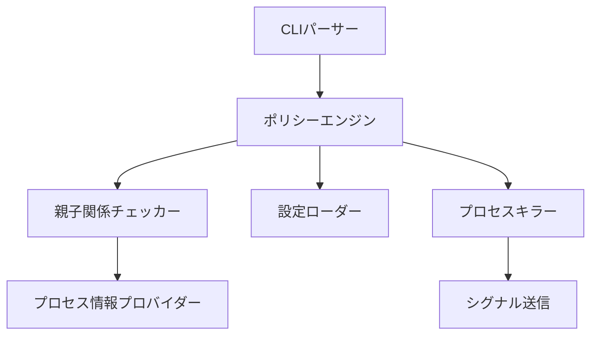

# アーキテクチャ

`safe-kill` がプロセスを終了してよいかを判定する仕組みと、シグナルを送る前と送る直前に行う検査を説明します。結果としてどのプロセスを終了できるかは、README の[終了できるプロセス](../README.ja.md#終了できるプロセス)にまとめています。

## 構成要素

## 安全レイヤー

1. **自己破壊防止**: 自身および親プロセスの終了を拒否。ポリシー判定時の早期拒否に加え、`kill(2)` 直前に最新の親 PID を OS から再取得して再検証する。判定～kill の間に親が入れ替わった（再ペアレント）場合も fail-closed で拒否し、親 PID が不明な場合も安全側に倒す
2. **PID検証**: 危険なPID値（`0`・範囲外）をシグナル送信前に拒否。kill 直前の TOCTOU 検証で使う fresh なプロセス情報取得でも、OS のプロセス snapshot を参照する前に PID `0` と `i32::MAX` 超過を拒否する
3. **拒否リストチェック**: システムプロセスは常に保護
4. **PID 1 保護**: PID 1（init/launchd 相当）自体は常に kill 対象から外す。コンテナ環境では PID 1 が `node` / `python` などの非標準プロセスとして既定拒否リストに含まれないケースがあり、許可リスト経由やポート kill でも巻き添えで終了させるとコンテナ全体が落ちるため、親子関係 / 許可リスト判定より手前で fail-closed する（`can_kill` と `can_kill_for_port` の両経路）
5. **ルートPID保護**: 信頼ルート自体は許可リストに含まれていても終了不可
6. **許可リストバイパス**: 信頼されたプロセスは親子関係チェックをスキップ
7. **親子関係検証**: ルートセッションの子孫のみ終了可能。PID 1（init/launchd）は信頼ルートとして採用しない。自動検出でルートが PID 1 になる環境（コンテナや systemd サービス配下など、親が PID 1 のケース）では、より内側（親→現在プロセス）へフォールバックして fail-closed に倒し、全プロセスを子孫扱いしてしまうことを防ぐ。さらに信頼ルートの初期 identity（`pid + start_time + name`）を構築時に取得して保持し、すべての子孫判定で identity 同一性を検証する。identity 検証と親子チェーン探索は同一 snapshot 上で行い両者の TOCTOU 窓を最小化する。`refresh()` で identity は更新せず、不一致を検出した場合は以後 fail-closed に倒す（更新すると信頼ルート PID を再利用した別プロセスを正規の信頼ルートとして受け入れてしまうため）。低レベルの親子チェーン探索では、`target == ancestor` の同一 PID ケースを許可する前に対象 PID が存在することを確認する。直接の親 PID が祖先と一致した場合も、祖先が同じ snapshot に存在することを確認し、古い親 PID の値だけで子孫とは判定しない
8. **PID再利用検出 (TOCTOU 緩和)**: ポリシー判定後、`kill(2)` 直前に最新のプロセス情報を OS から取得し、`pid + start_time + name` の同一性を再検証。判定時と異なるプロセスへ PID が再利用されていれば `ProcessNotFound` で fail-closed する。`start_time` は秒精度のため、同一秒内に同名プロセスへ再利用されたケースは検出できない（実用上は極めて稀）。完全な保護には Linux の `pidfd_open` + `pidfd_send_signal` が必要
9. **kill 直前の親子関係再評価**: PID/名前指定で `KillPermission::Allowed`（親子関係経由）で許可されたプロセスは、`kill(2)` 直前に新しい `ProcessInfoProvider` snapshot で子孫判定をやり直す。判定～kill の間に対象が再ペアレントされて信頼ルート外に出ていた場合は `NotDescendant` として fail-closed する。`AllowedByAllowlist`（許可リストは設計上親子関係をバイパス）と `--port` 指定は再評価をバイパスする
10. **ポート保持の再検証 (`--port` 指定時)**: `kill(2)` 直前に対象ポートの保持者集合を再取得し、判定時の対象 PID/プロトコルが含まれなければ `NoProcessOnPort` で fail-closed する。判定～kill の間に対象がポートを離した場合、ユーザーの「ポートを解放したい」意図は既に達成されているため、余計なシグナル送信を抑止する
11. **端末制御文字のサニタイズ**: OS から取得したプロセス名・コマンドライン引数・エラーメッセージ本文・設定パスに含まれる ANSI escape（画面消去・OSC 等）、改行、タブ、C0/C1 制御文字、Unicode 17.0 の general category `Cf` に属する全 170 個の format 制御文字（双方向テキスト制御等）を `\xHH` または `\u{HHHH}` のエスケープ表記に置き換えてから出力する（`terminal.rs::sanitize_terminal` / `sanitize_path`）。`--list` 出力、kill 結果表示（`print_kill_result` の `name` 列と `message` 列の両方。`KillResult::failure` は `error.to_string()` を `message` に保持しており、`NotDescendant(pid, name)` や `Denylisted(name)` のように攻撃者プロセス名が含まれ得る）、`main()` の stderr エラー出力、`safe-kill init` の作成/スキップ/上書き確認パス、設定読み込み警告のすべてでサニタイズ済みの文字列のみが端末へ流れる。kill が拒否される側でも表示行の上書きや端末状態の改ざんを防ぎ、双方向制御文字による表示順偽装も防ぐ。サニタイズは `truncate` より前に行うため、escape sequence の途中で切られて端末状態が残ることもない。エスケープ導入文字 `\` 自身も `\\` に置換して変換の単射性を保つ（これを省くと、実際に ESC を含むプロセスと、リテラルで `\x1B[2J` という名前を持つプロセスの表示が一致してしまい、どちらが本当に制御文字を含むのか判別できなくなる）

    clap の使用方法エラーも同じ原則でサニタイズする。clap は `invalid value '<値>' for '[PID]'` のように引数値を無加工で埋め込み、clap 側に制御文字の除去は無く、`Error::print()` は anstream 経由で生バイトを書き出す。そのため端末では `\x1b[2J`（画面消去）や `\r`（行頭復帰による行の上書き）がそのまま画面へ届く。ANSI が落ちるのはパイプへ流したときだけなので、この穴は見落としやすい。`parse_args` は `Error::render()` でプレーンテキスト化し、`sanitize_terminal` に通してから `safe-kill: ...` の 1 行として書き出す。改行も他の制御文字と同様にエスケープするのは、描画後の文字列からは clap 自身のレイアウト改行と引数由来の改行を区別できないため。行構造を残すと、引数に改行を混ぜるだけで独立した `error:` 行を偽造でき、「保護設定を外して再実行せよ」といった偽の復旧手順をツール自身の診断として提示できてしまう。`--help` / `--version` は clap の色付けをそのまま使うが、それが安全なのは `Command` に `bin_name = "safe-kill"` を指定しているからである。未指定だと clap は Usage 行に `argv[0]` の basename を使い（`name` では塞げない）、制御文字を含む名前の symlink 経由や `exec -a` で起動すると `Usage: fake\rFORGED [OPTIONS] [PID]` のように生バイトがそのまま出力される

12. **スレッド（TID）除外**: `sysinfo` は既定でタスク（スレッド）も列挙するため、Linux では `/proc/<pid>/task/<tid>` のスレッドが独立したプロセスとして一覧に載る。スレッドは `prctl(PR_SET_NAME)` / `pthread_setname_np` で自分の名前を自由に変更でき、TID への `kill(2)` はスレッドグループ全体へ配送される。そのため防御しないと、denylist に載せたプロセスでも「そのスレッド名」を `--name` に渡せば名前一致を回避して本体を落とせてしまう。プロセス一覧の refresh は `without_tasks()` を明示し、`ProcessesToUpdate::Some` はこの設定に関わらず TID を返すため、参照側でも `thread_kind()` が `Some` のエントリを一律に拒否する。macOS は `proc_listallpids` がプロセスのみ返すため影響を受けない。

13. **設定ファイル種別と書き込みの検証**: 厳格設定読み込みと `safe-kill init` は、通常ファイルまたは通常ファイルへ解決できる symlink だけを受け入れる。壊れた symlink と特殊ファイルは I/O 前に拒否する。初期化時は検証済みの親ディレクトリを device/inode 照合後のFDで固定し、そこから `openat(O_NONBLOCK | O_NOFOLLOW)` で書き込み先を開く。取得した通常ファイルの device/inode は truncate 前に再検証し、検証時に存在しなかったパスは `O_CREAT | O_EXCL` による原子的な新規作成に限定する。FIFO での無期限待機とデバイスへの書き込みを拒否し、open 前の symlink・通常ファイル・親ディレクトリ置換は fail-closed、open 後の置換は固定済みFDへの書き込みでリダイレクトを防ぐ。

14. **設定ファイルの非公開権限**: 新規設定ディレクトリは `0700`、新規 `config.toml` は `0600` を上限として作成する。権限は作成時に指定するため、`umask 000` でも allowlist・denylist・許可ポートの認可設定を他ユーザーが変更できる状態にしない。
