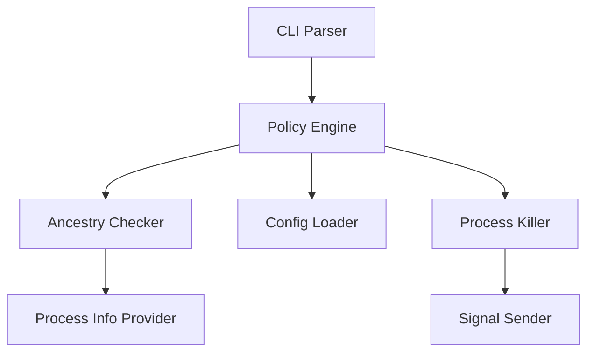

# Architecture

How `safe-kill` decides whether a process may be killed, and the checks it runs before and while sending a signal. Which processes end up killable is shown in the README's [What Can Be Killed](../README.md#what-can-be-killed).

## Components

## Safety Layers

1. **Suicide Prevention**: Cannot kill own process or parent. Beyond the early policy-time check, the current parent PID is re-resolved from the OS immediately before `kill(2)`, failing closed against re-parenting between the policy decision and signal dispatch (and also when the parent PID is unknown)
2. **PID Validation**: Reject unsafe PID values (`0`, out-of-range) before signal dispatch. The fresh process lookup used for pre-kill TOCTOU checks also rejects PID `0` and values beyond `i32::MAX` before consulting the OS process snapshot.
3. **Denylist Check**: System processes are always protected
4. **PID 1 Protection**: PID 1 (init/launchd, or a custom container entrypoint) is always refused as a kill target, ahead of ancestry / allowlist evaluation, in both `can_kill` and `can_kill_for_port`. Containers often run a non-standard PID 1 (e.g. `node`, `python`) that is not on the default denylist — without this guard an allowlist match or `--port` kill would take down the whole container.
5. **Root PID Protection**: The trust root itself is not killable, even if allowlisted
6. **Allowlist Bypass**: Trusted processes can skip ancestry checks
7. **Ancestry Verification**: Only descendants of root session are killable. PID 1 (init/launchd) is never trusted as the root — when auto-detection would resolve the root to PID 1 (e.g. inside a container or a systemd service where the parent is PID 1), it falls back inward (parent → current process) and fails closed, instead of treating every process as a descendant. The trust root's initial identity (`pid + start_time + name`) is captured at construction and re-validated on every descendant check. Identity verification and ancestry traversal run on the same provider snapshot to minimize the TOCTOU window between them; `refresh()` does not update the identity (a refreshed identity would silently trust a process that reused the root PID). Low-level ancestry traversal also requires the target PID to exist before accepting the reflexive `target == ancestor` case, so a nonexistent PID is never treated as its own descendant.
8. **PID Reuse Detection (TOCTOU mitigation)**: Re-validates `pid + start_time + name` immediately before `kill(2)`. If the OS has reused the PID for another process between policy decision and signal dispatch, the kill fails closed with `ProcessNotFound`. The `start_time` granularity is seconds, so reuse to a same-named process within the same second cannot be detected (extremely rare in practice). Full coverage would require Linux `pidfd_open` + `pidfd_send_signal`.
9. **Pre-kill Ancestry Re-check**: For PID/name kills authorized via ancestry (`KillPermission::Allowed`), the descendant check is re-run with a fresh `ProcessInfoProvider` snapshot right before `kill(2)`. This catches a target that was re-parented out of the trust root between the policy decision and signal dispatch, failing closed with `NotDescendant`. Allowlist (`AllowedByAllowlist`) and `--port` kills intentionally bypass ancestry by design, so the re-check is skipped for them.
10. **Port Hold Re-check (port mode only)**: For `--port` kills, the set of current holders of the target port is re-queried just before signaling. If the candidate PID/protocol is no longer present in that set (the target released the port between policy decision and `kill(2)`), the kill fails closed with `NoProcessOnPort`. This avoids killing a now-unrelated workload that happens to share the same PID after the user's intent (releasing the port) has already been satisfied.
11. **Terminal Output Sanitization**: Process names, command-line arguments, error message bodies, and config paths are escaped (`\n`, `\r`, `\t`, `\xHH`, `\u{HHHH}`) before they reach the terminal, including all 170 Unicode 17.0 general-category `Cf` format controls. This applies to `--list`, kill result lines (both the `name` column and the `message` column, since `KillResult::failure` stores `error.to_string()` which can embed the offending process name via `NotDescendant(pid, name)` / `Denylisted(name)`), the stderr error line emitted by `main()` (`safe-kill: ...`), `safe-kill init` created/skipped path output, overwrite prompts, and config-load warnings. Crafted argv or paths containing ANSI escape sequences, OSC sequences, newlines, or bidirectional Unicode controls cannot rewrite, hide, or visually reorder rows of output, and escape sequences cannot be cut mid-byte by the column-width truncation logic. The escape introducer `\` is itself escaped to `\\`, which keeps the transformation injective — without it, a process genuinely containing an ESC byte and a process literally named `\x1B[2J` would render identically, so a reader could not tell which one actually carries a control character.

    Clap usage errors are sanitized on the same principle. Clap embeds the offending argument verbatim (`invalid value '<value>' for '[PID]'`), performs no control-character removal of its own, and `Error::print()` writes raw bytes through `anstream` — so on a terminal, `\x1b[2J` (clear screen) or `\r` (carriage return, overwriting the line in place) reaches the screen unchanged. Only when the output is piped does `anstream` strip ANSI, which makes the gap easy to miss. `parse_args` therefore renders the error to plain text via `Error::render()`, passes it through `sanitize_terminal`, and writes it as a single `safe-kill: ...` line. Newlines are escaped along with everything else because a rendered string no longer distinguishes clap's own layout breaks from newlines that came in through an argument — keeping the line structure would let an argument forge a standalone `error:` line and present a fake recovery instruction ("disable the protection and retry") as the tool's own diagnostic. `--help` and `--version` keep clap's coloring, which is only safe because `Command` sets `bin_name = "safe-kill"`: without it clap uses the basename of `argv[0]` in the usage line (`name` does not cover this), so launching through a symlink whose name contains control characters — or via `exec -a` — would print `Usage: fake\rFORGED [OPTIONS] [PID]` with the raw bytes intact.

12. **Thread (TID) Exclusion**: `sysinfo` enumerates process tasks by default, so on Linux every `/proc/<pid>/task/<tid>` thread would show up as a process in its own right. Threads can rename themselves freely via `prctl(PR_SET_NAME)` / `pthread_setname_np`, and `kill(2)` on a TID is delivered to the whole thread group — so without this guard, a denylisted process could be taken down by passing one of *its threads'* names to `--name`, sidestepping the denylist entirely. The process snapshot is refreshed with `without_tasks()`, and because `ProcessesToUpdate::Some` returns a TID regardless of that setting, every read path additionally rejects entries with `thread_kind().is_some()`. macOS is unaffected (`proc_listallpids` returns processes only).

13. **Configuration File Type and Write Validation**: Strict configuration loading and `safe-kill init` accept only regular files or symlinks resolving to regular files. Dangling symlinks and special files are rejected before I/O. During initialization, the validated parent directory is pinned after a device/inode check, and the destination is opened relative to that directory descriptor with `openat(O_NONBLOCK | O_NOFOLLOW)`. The opened regular file's device/inode is checked before truncation, while a path absent during validation is limited to atomic `O_CREAT | O_EXCL` creation. FIFO hangs and device writes are rejected; symlink, regular-file, or parent-directory replacement before open fails closed, and replacement after open cannot redirect the pinned file descriptor.

14. **Private Configuration Permissions**: A newly created configuration directory is limited to mode `0700`, and a new `config.toml` to mode `0600`. The modes are supplied at creation time, so even `umask 000` cannot expose allowlist, denylist, or allowed-port policy to modification by other users.
